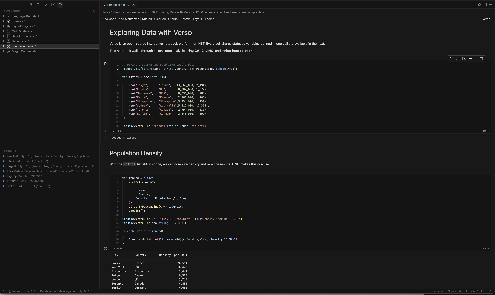
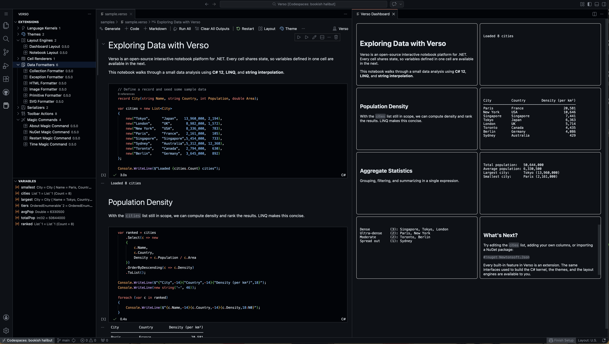
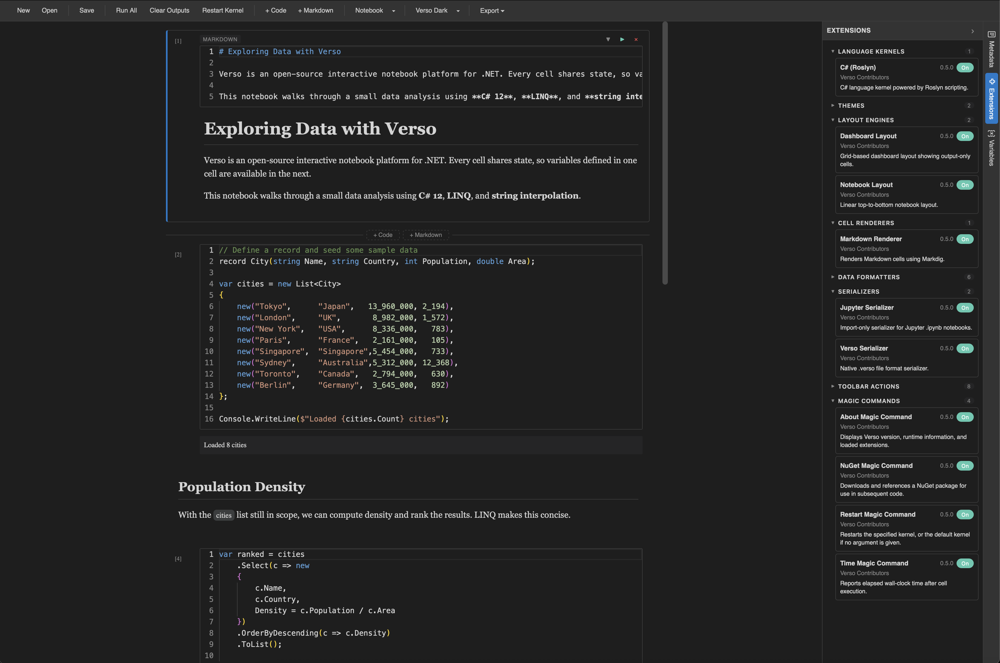
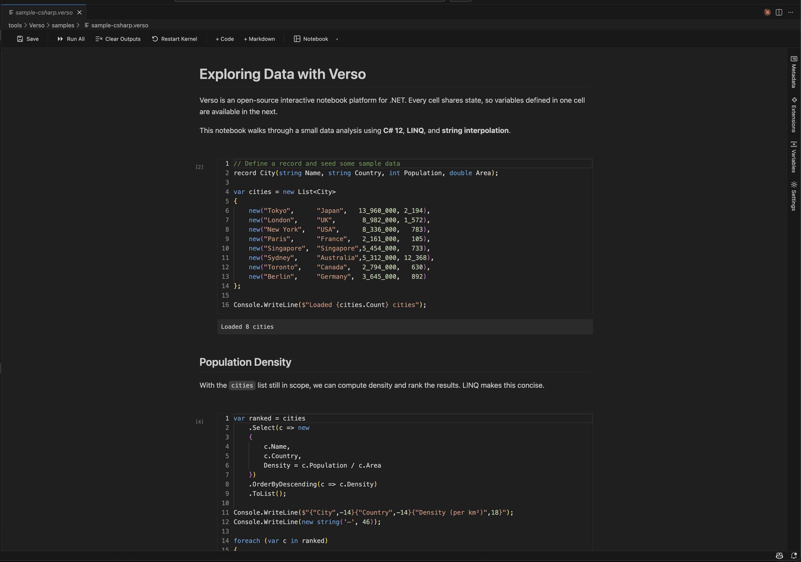

# Verso

**Open-source extensible interactive notebook platform for .NET.**

[](LICENSE)
[](https://dotnet.microsoft.com/download/dotnet/8.0)
<!--  -->



## What is Verso?

Verso is an open-source, extensible interactive notebook platform for .NET. It supports pluggable language kernels, custom cell types, theming, and switchable layout engines. Every feature is built on the same public extension interfaces available to third-party authors.

Microsoft deprecated Polyglot Notebooks on February 11, 2026, with a sunset date of March 27, 2026. Verso exists because the .NET ecosystem deserves a community-owned notebook platform that isn't subject to a single vendor's priorities.

The core engine is a headless library with no UI dependencies. Front-ends consume it through two channels: a VS Code extension (native notebook API or embedded Blazor WebAssembly) and a standalone Blazor Server web application. All UI components live in a shared Razor class library, and all notebook logic lives in the engine.

## Why Verso?

- **Polyglot Notebooks deprecated** with less than two months notice, leaving the .NET notebook ecosystem without an actively maintained tool.
- **Jupyter is Python-first.** .NET support requires third-party kernels with limited integration. No native IntelliSense, no variable explorer, no .NET-aware theming.
- **No community-owned alternative existed.** Every prior .NET notebook tool was controlled by a single organization.
- **Verso fills the gap** with an architecture designed for longevity: stable interfaces, pluggable everything, and dual-platform delivery from day one.

## Key Features

### C# Kernel Powered by Roslyn

Full C# scripting powered by Microsoft.CodeAnalysis. Latest C# language version, persistent state across cells, IntelliSense completions, real-time diagnostics, hover information, and NuGet package references via `#r "nuget: PackageName/Version"`.

### F# Kernel (Verso.FSharp) Powered by FSharp.Compiler.Service

Full F# scripting powered by FSharp.Compiler.Service. Latest F# language version (preview), persistent state across cells, IntelliSense completions, real-time diagnostics, hover information, and NuGet package references via `#r "nuget: PackageName"`. Includes a dedicated data formatter that renders discriminated unions, records, options, results, maps, sets, tuples, and collections as styled HTML tables with theme-aware CSS.

- **F# Interactive session** with configurable warning level, language version, and default opens
- **Bidirectional variable sharing** between F# and other kernels via `Variables.Set`/`Variables.Get` and a `tryGetVar<'T>` helper
- **IntelliSense** powered by `FSharpChecker`: dot-completion, type signatures, documentation, and error diagnostics
- **NuGet references** via `#r "nuget: PackageName"` with dual-path resolution (FSI built-in or Verso fallback)
- **Script directives** including `#r`, `#load`, `#I`, `#nowarn`, and `#time`
- **Rich data formatting** for F# types: records as field tables, DUs with case names and fields, options, results with Ok/Error styling, maps as key-value tables, sets, tuples, and collection truncation
- **Configurable settings** via `IExtensionSettings`: warning level, language version, private binding visibility, and collection display limits
- **Polyglot Notebooks migration** — automatic conversion of `#!fsharp`/`#!f#` magic, `#!set`, and `#!share` patterns during `.ipynb` import

Verso.FSharp references only `Verso.Abstractions` and `FSharp.Compiler.Service`.

### SQL Database Support (Verso.Ado)

Provider-agnostic SQL connectivity built as a first-party extension on the public `Verso.Abstractions` interfaces. Connect to any ADO.NET database, execute SQL with paginated result tables, share variables bidirectionally between SQL and C# cells, inspect schema metadata, and scaffold EF Core DbContext and entity classes at runtime.

- **Connection management** via `#!sql-connect` and `#!sql-disconnect` magic commands with named connections, provider auto-discovery, and credential security (`$env:`, `$secret:`)
- **SQL kernel** with execution, `@parameter` binding from C# variables, `GO` batch separators, and row limiting
- **IntelliSense** for SQL: keyword completions, table/column names from cached schema, `@variable` suggestions, and hover information
- **Paginated HTML result tables** with column type tooltips, NULL styling, and truncation warnings
- **CSV and JSON export** toolbar actions on SQL result cells
- **Schema inspection** via `#!sql-schema` with per-connection caching
- **EF Core scaffolding** via `#!sql-scaffold` — generates DbContext and entity classes from a live database, compiles at runtime, and registers in the variable store for LINQ queries
- **Polyglot Notebooks migration** — automatic conversion of `#!connect` and `#!sql` patterns during `.ipynb` import

Verso.Ado references only `Verso.Abstractions` and `System.Data.Common`. Users supply their own ADO.NET provider via `#r "nuget:"`.

### Ten Extension Interfaces

Every built-in feature uses the same public interfaces available to extension authors. There are no hidden internal APIs. If a built-in feature can't be built on the public interfaces, the interfaces are incomplete.

### Pluggable Layout Engines

View the same notebook as a linear document or a 12-column grid dashboard. Switch layouts at runtime. Each layout declares capability flags (`CellInsert`, `CellDelete`, `CellReorder`, `CellResize`, `CellExecute`, `MultiSelect`) that the engine enforces. Build your own by implementing `ILayoutEngine`.



### Standalone Blazor App

Full notebook experience in the browser, independent of any IDE. Includes the Monaco editor for code cells, a variable explorer, extension management, and toolbar actions. Deploy as a Blazor Server application or embed in VS Code via WebAssembly.

The Blazor UI is split into a shared Razor component library (`Verso.Blazor.Shared`) consumed by two hosts:
- **Blazor Server** (`Verso.Blazor`) — standalone web app with in-process engine access
- **Blazor WebAssembly** (`Verso.Blazor.Wasm`) — runs inside a VS Code webview, communicating with the engine via a postMessage/JSON-RPC bridge

Both hosts implement the same `INotebookService` interface, so a single set of Razor components powers every front-end.

**Blazor Standalone Server:**


**Blazor WebAssembly in VS Code:**


### Comprehensive Theming

Design token system covering editor colors, cell styling, UI components, syntax highlighting, typography, and spacing. Three built-in themes (Light, Dark, and High Contrast) ship out of the box. The High Contrast theme meets WCAG 2.1 AA contrast requirements for accessibility. Hot-swap themes at runtime. Create your own by implementing `ITheme`.

### Custom Cell Types

Go beyond code and markdown. Define domain-specific cell types with their own renderers and optional language kernels by implementing `ICellType`, which pairs an `ICellRenderer` with an optional `ILanguageKernel`.

### Variable Sharing

`IVariableStore` persists state across cell executions and language kernels. Thread-safe, backed by `ConcurrentDictionary`, with change notifications. Variables are visible in the variable explorer sidebar in both VS Code and Blazor.

### Magic Commands

`#!time`, `#!nuget`, `#!restart`, `#!about`, and `#!import` ship built in. Add your own through `IMagicCommand`. Magic commands can suppress normal code execution or augment it, and they receive full context including the variable store and extension host.

### Notebook Import (`#!import`)

Import and execute code from another notebook:

    #!import ./helpers/setup.verso
    #!import ../shared/utilities.ipynb
    #!import /absolute/path/to/notebook.verso

Reads the target notebook, deserializes it (.verso or .ipynb), and executes all code cells
in the current kernel session. Variables, functions, and state become available in subsequent
cells. Markdown and raw cells are skipped. Paths resolve relative to the current notebook's
directory. Polyglot Notebooks `#!import` syntax is compatible — existing .ipynb files with
`#!import` directives work automatically.

### .verso File Format

JSON-based format that stores notebook metadata, cell content and outputs, layout positioning, theme preferences, and extension requirements. Human-readable, diff-friendly, and versioned with a format identifier (`"verso": "1.0"`).

### Jupyter Import

One-way `.ipynb` import for migration from existing Jupyter notebooks. Supports nbformat v4+, maps code/markdown/raw cell types, and preserves execution count metadata. When Verso.Ado is loaded, Polyglot Notebooks SQL patterns (`#!connect`, `#!sql`) are automatically converted to native Verso SQL cells. When Verso.FSharp is loaded, Polyglot Notebooks F# patterns (`#!fsharp`, `#!f#`, `#!set`, `#!share`) are automatically converted to native F# cells.

## Architecture Overview

Verso uses a layered architecture that separates concerns cleanly:

- **Verso.Abstractions**: Pure interfaces with zero external dependencies. This is the only package extension authors reference.
- **Verso**: Headless engine library containing the Scaffold Layer, Extension Host, Theme Engine, Layout Manager, Execution Pipeline, and all built-in extensions. Depends on Roslyn, Markdig, and NuGet.Protocol.
- **Verso.Host**: Console application that wraps the engine in a JSON-RPC 2.0 protocol over stdin/stdout, enabling communication with the VS Code extension.
- **Verso.VSCode**: Thin TypeScript adapter for the VS Code Notebook API. Handles UI concerns only; all logic lives in the engine.
- **Verso.Blazor.Shared**: Razor class library containing all shared UI components (cells, toolbar, panels, editor, theme provider) and the `INotebookService` abstraction. Depends only on `Verso.Abstractions`.
- **Verso.Blazor**: Standalone Blazor Server web application. Implements `INotebookService` in-process via `ServerNotebookService`, with direct access to the engine.
- **Verso.Blazor.Wasm**: Blazor WebAssembly project that runs inside a VS Code webview. Implements `INotebookService` remotely via `RemoteNotebookService`, communicating through a postMessage/JSON-RPC bridge. References only `Verso.Abstractions` and `Verso.Blazor.Shared` (no engine dependencies).
- **Verso.FSharp**: First-party extension providing an F# language kernel with IntelliSense, NuGet/script directives, rich data formatting for F# types, configurable settings, and Polyglot Notebooks F# import. References only `Verso.Abstractions` and `FSharp.Compiler.Service`.
- **Verso.Ado**: First-party extension providing SQL database connectivity, result set formatting, schema inspection, EF Core scaffolding, and Polyglot Notebooks SQL import. References only `Verso.Abstractions`.

```
  Front-Ends
  ┌───────────────────────┐  ┌───────────────────────┐
  │  Verso.VSCode         │  │  Verso.Blazor         │
  │  (VS Code Adapter)    │  │  (Blazor Server)      │
  │  + Verso.Blazor.Wasm  │  │                       │
  │    (Webview WASM)     │  │                       │
  └───────────┬───────────┘  └───────────┬───────────┘
              │                          │
  ┌──────────────────────────────────────────────────┐
  │  Verso.Blazor.Shared (Razor Class Library)       │
  │  INotebookService | Components | Interop JS      │
  └──────────────────────────────────────────────────┘
              │                          │
  ════════════════════════════════════════════════════
  Verso Engine (headless NuGet library)
  ┌────────────────────────────────────────────────┐
  │  Scaffold Layer                                │
  │  Cell Mgmt | Execution Pipeline                │
  ├────────────────┬───────────────┬───────────────┤
  │ Extension Host │ Theme Engine  │ Layout Manager│
  ├────────────────┴───────────────┴───────────────┤
  │  Built-in Extensions (via Verso.Abstractions)  │
  │  C# Kernel | Markdown | Formatters             │
  │  Light/Dark/HighContrast Themes | Layouts      │
  ├────────────────────────────────────────────────┤
  │  Verso.FSharp (first-party extension package)  │
  │  F# Kernel | IntelliSense | NuGet/Scripts      │
  │  Data Formatter | Settings | F# Import         │
  ├────────────────────────────────────────────────┤
  │  Verso.Ado (first-party extension package)     │
  │  SQL Kernel | Connection Mgmt | Schema Cache   │
  │  Result Formatter | EF Scaffold | SQL Import   │
  └────────────────────────────────────────────────┘
  ═══════════════════════════════════════════════════

  Verso.Abstractions (pure interfaces, referenced by all)
  ILanguageKernel | ICellRenderer | IToolbarAction
  ITheme | ILayoutEngine | IMagicCommand | IDataFormatter
  ICellType | INotebookSerializer | IExtension
```

```
  Verso.VSCode ─────┐
  + Verso.Blazor.Wasm│
    (WASM webview)  ├──▶ Verso (Engine) ──▶ Verso.Abstractions
                    │          ▲
  Verso.Blazor ─────┘          │
                    Verso.Blazor.Shared ──▶ Verso.Abstractions
                    (shared components)

  Verso.FSharp ──────────▶ Verso.Abstractions (+ FSharp.Compiler.Service)
  Verso.Ado ─────────────▶ Verso.Abstractions (only)
  Third-Party Extensions ──▶ Verso.Abstractions (only)
```

Extension authors never reference the engine or either front-end. They depend solely on `Verso.Abstractions`, which guarantees their extensions work across all front-ends without modification.

## The Extension Model

The extension model is the heart of Verso. Ten interfaces define every point of extensibility:

| Interface | Purpose |
|-----------|---------|
| `ILanguageKernel` | Execute code, provide completions, diagnostics, and hover info for a language |
| `ICellRenderer` | Render input and output areas of a cell with syntax highlighting support |
| `ICellType` | Pair a renderer with an optional kernel to define a new cell type |
| `IToolbarAction` | Add buttons to the notebook toolbar or cell context menus |
| `IDataFormatter` | Format runtime objects into displayable cell outputs |
| `IMagicCommand` | Define inline directives like `#!time` that extend kernel functionality |
| `ITheme` | Provide a complete visual theme with colors, typography, spacing, and syntax colors |
| `ILayoutEngine` | Manage spatial arrangement of cells (linear, grid, or anything custom) |
| `INotebookSerializer` | Serialize and deserialize notebooks to file formats |
| `INotebookPostProcessor` | Transform notebooks after deserialization or before serialization (e.g. migrate legacy formats, inject metadata) |

A supplementary augmentation interface, `IExtensionSettings`, can be co-implemented alongside any primary capability to expose configurable settings to the UI.

All interfaces inherit from `IExtension`, which provides identity, metadata, and lifecycle hooks (`OnLoadedAsync`, `OnUnloadedAsync`).

**Dogfooding principle.** Every built-in feature is an extension. The C# kernel is an `ILanguageKernel`. The dark theme is an `ITheme`. The dashboard is an `ILayoutEngine`. The markdown cell is an `ICellRenderer`. If a built-in can't be built on the public interfaces, the interfaces are incomplete.

**Extension isolation.** Third-party extensions load in their own `AssemblyLoadContext` (named `VersoExt:{AssemblyName}`), collectible and unloadable. The `Verso.Abstractions` types are shared from the default context to maintain interface identity across isolation boundaries.

## Built-in Extensions

What ships out of the box:

| Category | Extensions |
|----------|-----------|
| **Kernel** | C# (Roslyn), latest language version, persistent state, IntelliSense, diagnostics, hover, NuGet; F# (FSharp.Compiler.Service) via Verso.FSharp |
| **Renderer** | Markdown (Markdig with advanced extensions) |
| **Data Formatters** | Primitives, Collections (HTML tables, up to 100 rows), HTML (`ToHtml()`), Images (PNG/JPEG/GIF/BMP/WebP), SVG, Exceptions (structured with inner exception support) |
| **Themes** | Verso Light, Verso Dark, Verso High Contrast (WCAG 2.1 AA) |
| **Layouts** | Notebook (linear), Dashboard (12-column CSS grid with drag handles and bin-packing) |
| **Magic Commands** | `#!time`, `#!nuget`, `#!restart`, `#!about`, `#!import` |
| **Toolbar Actions** | Run Cell, Run All, Clear Outputs, Restart Kernel, Switch Layout, Switch Theme, Export HTML, Export Markdown |
| **Serializers** | `.verso` native (JSON, pretty-printed, camelCase), `.ipynb` import (nbformat v4+) |

### Verso.FSharp Extensions

The Verso.FSharp package adds F# language support as a first-party extension:

| Category | Extensions |
|----------|-----------|
| **Kernel** | F# (FSharp.Compiler.Service), IntelliSense completions, diagnostics, hover, NuGet references, script directives (`#r`, `#load`, `#I`, `#nowarn`, `#time`) |
| **Data Formatter** | Rich HTML rendering for discriminated unions, records, options, results, maps, sets, tuples, and collections with theme-aware CSS |
| **Settings** | `warningLevel`, `langVersion`, `publishPrivateBindings`, `maxCollectionDisplay` via `IExtensionSettings` |
| **Serializer** | Jupyter F# import hook (converts Polyglot Notebooks `#!fsharp`/`#!f#`, `#!set`, `#!share` patterns) |

### Verso.Ado Extensions

The Verso.Ado package adds SQL database support as a first-party extension:

| Category | Extensions |
|----------|-----------|
| **Kernel** | SQL (ADO.NET), keyword/table/column completions, hover, diagnostics, `@variable` parameter binding |
| **Cell Type + Renderer** | SQL cell with connection indicator and paginated HTML result tables |
| **Data Formatter** | Result set formatter with paging, NULL styling, column type tooltips, truncation warnings |
| **Magic Commands** | `#!sql-connect`, `#!sql-disconnect`, `#!sql-schema`, `#!sql-scaffold` |
| **Toolbar Actions** | Export CSV, Export JSON (on SQL result cells) |
| **Serializer** | Jupyter SQL import hook (converts Polyglot Notebooks `#!connect`/`#!sql` patterns) |

## Writing Extensions

Verso includes documentation and tooling for building your own extensions:

- **Getting started guide** (`docs/getting-started.md`): project setup, `dotnet new verso-extension` template, building, and loading extensions.
- **Interface reference** (`docs/extension-interfaces.md`): detailed API documentation for all ten extension interfaces.
- **Theme authoring guide** (`docs/theme-authoring.md`): token reference, typography, spacing, syntax color mapping, WCAG accessibility guidance.
- **Layout authoring guide** (`docs/layout-authoring.md`): capability flags, metadata persistence, cell container positioning, HTML conventions.
- **Testing extensions** (`docs/testing-extensions.md`): `Verso.Testing` library with stub contexts for unit testing.
- **Best practices** (`docs/best-practices.md`): state management, thread safety, extension isolation.

### Sample Extensions

| Sample | Type | Location |
|--------|------|----------|
| **Dice** | `ILanguageKernel` + `ICellRenderer` + `IToolbarAction` | `samples/SampleExtension/Verso.Sample.Dice/` |
| **Presentation Layout** | `ILayoutEngine` (slide-based navigation) | `samples/SampleLayout/Verso.Sample.Slides/` |
| **Diagram Editor** | `ICellType` + `ICellRenderer` + `ILanguageKernel` | `samples/SampleCellType/Verso.Sample.Diagram/` |

Each sample references only `Verso.Abstractions` and includes a companion test project.

## Getting Started

### Prerequisites

- [.NET 8 SDK](https://dotnet.microsoft.com/download/dotnet/8.0)
- [VS Code](https://code.visualstudio.com/) (for the extension) or a browser (for Blazor)

### Build and Run

```bash
# Clone the repository
git clone https://github.com/DataficationSDK/Verso
cd Verso

# Build the solution
dotnet build Verso.sln

# Run the Blazor app
dotnet run --project src/Verso.Blazor

# Run tests
dotnet test Verso.sln
```

### VS Code Extension

```bash
# Build the host
dotnet build src/Verso.Host

# Package the extension (includes Blazor WASM build)
cd vscode
npm install
npm run build:all
npx vsce package --skip-license
```

Install the generated `.vsix` file in VS Code, then open any `.verso` file or import a `.ipynb` notebook. Use "Open With..." to choose between the native notebook view and the Blazor-powered editor.

## Roadmap

| Phase | Version | Status |
|-------|---------|--------|
| **Phase 1: Foundation** | v0.1 | Complete |
| Abstractions, Scaffold, C# Kernel, Extension Host, Formatters, Themes, Layouts, Serializers | | |
| **Phase 2: Standalone & Polish** | v0.5 | Complete |
| Blazor application, VS Code extension, JSON-RPC host, variable explorer, toolbar actions, export | | |
| **Verso.Ado: SQL Database Support** | v0.5 | Complete |
| SQL kernel, connection management, paginated result tables, schema inspection, CSV/JSON export, EF Core scaffolding, Polyglot Notebooks SQL import | | |
| **Verso.FSharp: F# Language Support** | v0.6 | Complete |
| F# kernel, IntelliSense, NuGet/script directives, rich data formatting, configurable settings, Polyglot Notebooks F# import | | |
| **Phase 3A: Extension Authoring Toolkit** | v0.7 | Complete |
| Extension authoring docs, `dotnet new` project template, sample extension (Dice), testing utilities (`Verso.Testing`), NuGet packaging guide | | |
| **Phase 3B: Theme + Layout Guides and Samples** | v0.7 | Complete |
| Theme authoring guide, High Contrast accessibility theme, layout authoring guide, sample Presentation layout, sample Diagram cell type | | |
| **Phase 3 (continued): Ecosystem** | v1.0 | In progress |
| CI/CD pipeline, community governance, extension marketplace | | |

## Contributing

Contributions are welcome. The project is entering Phase 3, which includes establishing community governance and a formal contribution process. A `CONTRIBUTING.md` guide is planned as part of that phase.

In the meantime, open an issue to discuss what you'd like to work on.

## License

[MIT](LICENSE)

Verso is a Datafication project.
