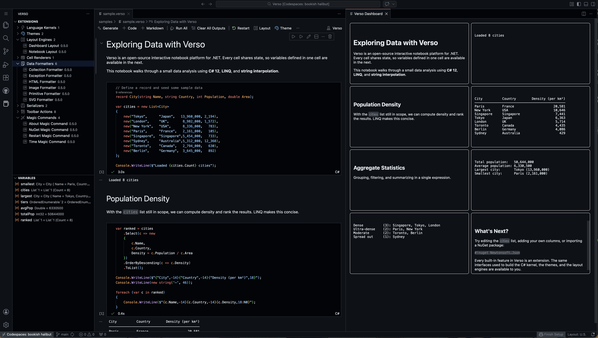
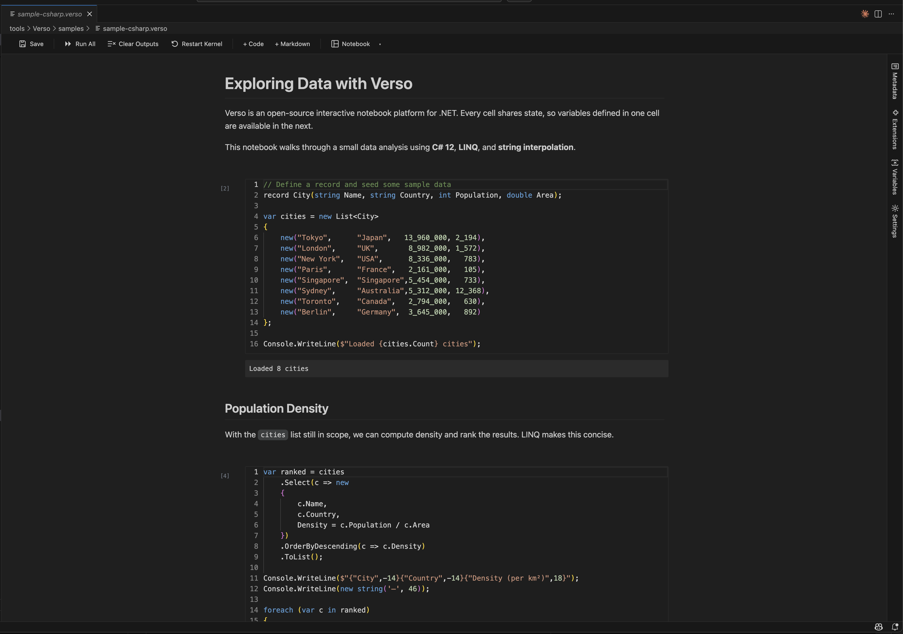
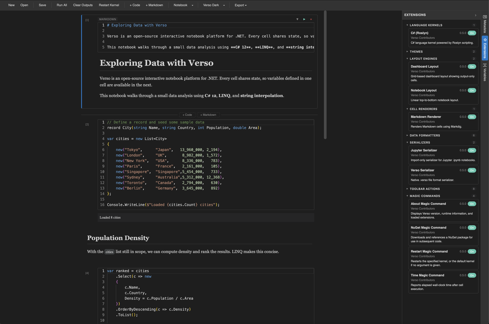

# Verso

**Open-source interactive notebook platform for .NET, built on a fully extensible architecture.**

[](LICENSE.md)
[](https://dotnet.microsoft.com/download/dotnet/10.0)

[](https://www.nuget.org/packages/Verso)
[](https://github.com/DataficationSDK/Verso/releases)
[](https://marketplace.visualstudio.com/items?itemName=Datafication.verso-notebook)


## The Story

Microsoft deprecated Polyglot Notebooks on February 11, 2026, giving the community less than two months notice before sunset. Jupyter supports .NET through third-party kernels, but the experience has always been limited: no native IntelliSense, no variable explorer, no .NET-aware theming.

Verso started from a simple question: what would an interactive notebook look like if it were designed from the ground up for .NET, with extensibility as a first principle instead of an afterthought?

The answer is a platform where *every* feature, from the C# kernel to the dark theme to the dashboard layout, is built on the same public interfaces available to anyone writing an extension. There are no internal APIs. If a built-in feature can't be built on the public extension interfaces, the interfaces are incomplete.

## Supported Languages

| Language | IntelliSense | Variable Sharing |
|----------|:------------:|:----------------:|
| C#         | Yes          | Yes              |
| F#         | Yes          | Yes              |
| PowerShell | Yes          | Yes              |
| Python     | Yes          | Yes              |
| SQL        | Yes          | Yes              |
| HTTP       | Yes          | Yes              |
| Markdown | N/A          | N/A              |
| HTML     | N/A          | Yes              |
| Mermaid  | N/A          | Yes              |

## How It Works

Verso is split into layers that each do one thing:

```
┌─────────────────────────────────────────────────────────┐
│  Front-Ends                                             │
│  ┌─────────────────────┐  ┌──────────────────────────┐  │
│  │  VS Code Extension  │  │  Blazor Server Web App   │  │
│  │  (Blazor WASM       │  │  (runs in any browser)   │  │
│  │   inside a webview) │  │                          │  │
│  └──────────┬──────────┘  └────────────┬─────────────┘  │
│             │                          │                │
│  ┌──────────────────────────────────────────────────┐   │
│  │  Shared UI (Razor Class Library)                 │   │
│  │  Monaco editor, panels, toolbar, theme provider  │   │
│  └──────────────────────────────────────────────────┘   │
└─────────────────────────────────────────────────────────┘
                          │
┌─────────────────────────────────────────────────────────┐
│  Verso Engine (headless .NET library, no UI)            │
│  ┌────────────────────────────────────────────────────┐ │
│  │  Scaffold · Extension Host · Execution Pipeline    │ │
│  │  Layout Manager · Theme Engine · Variable Store    │ │
│  ├────────────────────────────────────────────────────┤ │
│  │  Built-in Extensions                               │ │
│  │  C# Kernel · Markdown · HTML · Mermaid · Themes    │ │
│  │  Notebook Layout · Dashboard Layout · Formatters   │ │
│  ├────────────────────────────────────────────────────┤ │
│  │  First-Party Extension Packages                    │ │
│  │  Verso.FSharp · Verso.PowerShell · Verso.Python    │ │
│  │  Verso.Ado (SQL) · Verso.Http (HTTP)               │ │
│  └────────────────────────────────────────────────────┘ │
└─────────────────────────────────────────────────────────┘
                          │
┌─────────────────────────────────────────────────────────┐
│  Verso.Abstractions                                     │
│  Pure interfaces, zero dependencies                     │
│  The only package extension authors need to reference   │
└─────────────────────────────────────────────────────────┘
```

The engine is a headless library with no UI dependencies. It doesn't know whether it's running inside VS Code, a browser, or a test harness. Front-ends connect through two paths:

- **Blazor Server** talks to the engine directly, in-process
- **VS Code** runs Blazor WebAssembly in a webview, which communicates with a host process over JSON-RPC (stdin/stdout)

Both paths use the same shared Razor components for the UI, so the experience is identical everywhere.

## What You Can Do


### Write and Run C# with Full IntelliSense

The C# kernel is powered by Roslyn. You get the latest C# language version, persistent state across cells, completions, real-time diagnostics, hover information, and NuGet package references via `#r "nuget: PackageName/Version"`.

### Write and Run F#

Verso.FSharp brings full F# scripting powered by FSharp.Compiler.Service. IntelliSense, diagnostics, NuGet references, script directives (`#r`, `#load`, `#I`), and a dedicated data formatter that renders discriminated unions, records, options, results, maps, and collections as styled HTML tables.

<!-- TODO: Screenshot of F# cell with rich DU/record output formatting -->

### Write and Run PowerShell

Verso.PowerShell hosts a persistent PowerShell runspace with full cmdlet support. State persists across cells, pipelines render through `Out-String` for proper formatting, and variables are automatically shared with other kernels. IntelliSense includes completions via `CommandCompletion`, parse diagnostics via the PowerShell AST parser, and hover information.

<!-- TODO: Screenshot of PowerShell cell -->

### Write and Run Python

Verso.Python embeds CPython via pythonnet. You get IntelliSense (completions, diagnostics, hover) powered by jedi, bidirectional variable sharing with C#/F#/SQL cells, and virtual environment support via the `#!pip` magic command. Requires **Python 3.8–3.12** installed on the system (Python 3.13+ is not yet supported by pythonnet).

<!-- TODO: Screenshot of Python cell -->

### Query Databases with SQL

Verso.Ado adds provider-agnostic SQL connectivity. Connect to any ADO.NET database, execute queries with paginated result tables, share variables between SQL and C# cells, inspect schema, and scaffold EF Core DbContext classes at runtime.

```
#!sql-connect --name mydb --provider Microsoft.Data.SqlClient --connectionString "..."
```

<!-- TODO: Screenshot of SQL cell with paginated result table -->

### Send HTTP Requests

Verso.Http adds an HTTP cell type using `.http` file syntax, the same format supported by VS Code's REST Client and JetBrains HTTP Client. Send GET, POST, PUT, PATCH, DELETE, and other requests directly in your notebook. Features include variable interpolation (`@name = value` and `{{name}}`), dynamic variables (`{{$guid}}`, `{{$timestamp}}`, `{{$randomInt}}`), named request chaining (`# @name` with `{{name.response.body.$.path}}`), multiple requests per cell (`###` separator), and cross-kernel integration where response data is automatically shared to C#, F#, and other cells.

```
#!http-set-base https://api.example.com
```

<!-- TODO: Screenshot of HTTP cell with formatted response -->

### Switch Between Notebook and Dashboard Layouts

The same notebook can be viewed as a linear document or rearranged into a 12-column grid dashboard. Drag cells to reposition them, resize with handles, and the layout is saved in the `.verso` file. Switch between layouts at runtime.



### Use Markdown, HTML, and Mermaid Cells

Beyond code, notebooks support Markdown (rendered via Markdig), raw HTML, and Mermaid diagrams. HTML and Mermaid cells support `@variable` substitution from the shared variable store, so you can build dynamic documents that update when your data changes.

### Swap Themes at Runtime

Three built-in themes ship out of the box: Light, Dark, and High Contrast. The High Contrast theme meets WCAG 2.1 AA contrast requirements. Themes are hot-swappable and cover everything from editor colors to syntax highlighting to cell borders.

<!-- TODO: Screenshot or GIF showing theme switching (light → dark → high contrast) -->

### Import Jupyter and Polyglot Notebooks

Open any `.ipynb` or `.dib` file and Verso converts it automatically. Polyglot Notebooks patterns like `#!fsharp`, `#!connect`, and `#!sql` are mapped to native Verso cells during import. The `.dib` parser handles `#!meta` blocks, all standard language directives, and custom kernel directives.

### Share Variables Across Languages

The variable store persists state across cell executions and language kernels. Set a value in C#, read it in F#, PowerShell, or bind it as a SQL parameter. The variable explorer panel shows everything that's in scope.

## Run It Wherever You Want

### VS Code

Install the extension, open a `.verso` file, and the full notebook UI loads in a webview. The engine runs as a separate host process, so VS Code stays responsive.



### Browser

Run the Blazor Server app and open it in any browser. Same UI, same features, no IDE required.



## The Extension Model

This is the core idea behind Verso. Eleven interfaces define every point of extensibility, and every built-in feature is implemented as an extension using those same interfaces:

| Interface | What It Does |
|-----------|-------------|
| `ILanguageKernel` | Execute code, provide completions, diagnostics, and hover for a language |
| `ICellRenderer` | Render the input and output areas of a cell |
| `ICellType` | Pair a renderer with an optional kernel to define a new cell type |
| `IToolbarAction` | Add buttons to the notebook toolbar or cell menus |
| `IDataFormatter` | Format runtime objects into displayable outputs |
| `IMagicCommand` | Define directives like `#!time` that extend kernel behavior |
| `ITheme` | Provide colors, typography, spacing, and syntax highlighting |
| `ILayoutEngine` | Manage spatial arrangement of cells (linear, grid, slides, anything) |
| `INotebookSerializer` | Read and write notebook file formats |
| `INotebookPostProcessor` | Transform notebooks after load or before save |
| `ICellInteractionHandler` | Handle bidirectional interactions from rendered cell content back to extension code |

Extensions can also implement `IExtensionSettings` to expose configurable settings in the UI.

### Interactive Cell Content

Extensions that implement `ICellInteractionHandler` can receive structured messages from their rendered HTML output. This enables scenarios like server-side pagination, interactive data exploration, configuration wizards, and in-place output updates — all without embedding full datasets in the initial HTML payload.

The interaction model uses `CellInteractionContext` to describe each event (origin region, interaction type, JSON payload, output block ID) and returns an optional response that the rendered content can use to update the DOM. Extensions can also call `UpdateOutputAsync` on `IVersoContext` to replace a previously written output block, supporting progressive rendering and live-updating displays.

The interaction pipeline works across all hosting paths: in-process for Blazor Server, over the JSON-RPC bridge for Blazor WASM / VS Code, and programmatically for CLI or test harnesses.

### Dogfooding All the Way Down

The C# kernel is an `ILanguageKernel`. The dark theme is an `ITheme`. The dashboard is an `ILayoutEngine`. The Markdown renderer is an `ICellRenderer`. None of them have special access to engine internals. If you look at how the built-in C# kernel is wired up, that's exactly how you'd wire up your own language kernel.

### Extension Isolation

Third-party extensions load in their own `AssemblyLoadContext`, collectible and unloadable. The `Verso.Abstractions` types are shared from the default context so interface identity works across isolation boundaries. Your extension references only `Verso.Abstractions` and works across every front-end without modification.

### Build Your Own

```bash
dotnet new verso-extension -n MyExtension
```

Verso includes a `dotnet new` template, a testing library (`Verso.Testing`), and documentation covering all eleven interfaces, theme authoring, layout authoring, and best practices.

**Sample extensions included in the repo:**

| Sample | What It Shows |
|--------|--------------|
| **Dice** | Custom kernel + renderer + toolbar action |
| **Presentation Layout** | Slide-based navigation layout |
| **Diagram Editor** | Custom cell type with its own kernel |

## What Ships Out of the Box

| Category | Included |
|----------|----------|
| **Kernels** | C# (Roslyn), F# (FSharp.Compiler.Service via Verso.FSharp), PowerShell (System.Management.Automation via Verso.PowerShell), Python (pythonnet via Verso.Python), HTTP (via Verso.Http) |
| **Cell Types** | Code, Markdown, HTML, Mermaid, SQL (via Verso.Ado), HTTP (via Verso.Http) |
| **Themes** | Light, Dark, High Contrast (WCAG 2.1 AA) |
| **Layouts** | Notebook (linear), Dashboard (12-column CSS grid with drag-and-resize) |
| **Magic Commands** | `#!time`, `#!nuget`, `#!pip`, `#!extension`, `#!restart`, `#!about`, `#!import`, `#!http-set-base`, `#!http-set-header`, `#!http-set-timeout` |
| **Toolbar Actions** | Run Cell, Run All, Clear Outputs, Restart, Switch Layout, Switch Theme, Export HTML, Export Markdown |
| **Data Formatters** | Primitives, Collections (HTML tables), HTML, Images, SVG, Exceptions, F# types (via Verso.FSharp), SQL result sets (via Verso.Ado) |
| **Serializers** | `.verso` (native JSON format), `.ipynb` import (Jupyter nbformat v4+), `.dib` import (Polyglot Notebooks) |

## The `.verso` File Format

JSON-based, human-readable, and diff-friendly. Stores notebook metadata, cell content with outputs, layout positioning, and theme preferences. Everything in one file:

```json
{
  "verso": "1.0",
  "metadata": {
    "defaultKernel": "csharp",
    "activeLayout": "notebook",
    "preferredTheme": "verso-light"
  },
  "cells": [
    {
      "id": "...",
      "type": "code",
      "language": "csharp",
      "source": "Console.WriteLine(\"Hello from Verso\");",
      "outputs": [...]
    }
  ],
  "layouts": {
    "dashboard": {
      "cells": {
        "cell-id": { "row": 0, "col": 0, "width": 6, "height": 4 }
      }
    }
  }
}
```

## Getting Started

### Prerequisites

- [.NET 8 SDK](https://dotnet.microsoft.com/download/dotnet/8.0) or [.NET 10 SDK](https://dotnet.microsoft.com/download/dotnet/10.0) (library packages target both; the host process runs on either via `RollForward`)
- [VS Code](https://code.visualstudio.com/) (for the extension, desktop only — browser-based environments like GitHub Codespaces are not supported) or any modern browser (for Blazor)
- [Python 3.8–3.12](https://www.python.org/downloads/) (optional, for the Python kernel — Python 3.13+ is not yet supported by pythonnet)

### Run in the Browser

```bash
git clone https://github.com/DataficationSDK/Verso
cd Verso
dotnet build Verso.sln
dotnet run --project src/Verso.Blazor
```

### Run in VS Code

```bash
dotnet build src/Verso.Host
cd vscode
npm install
npm run build:all
npx vsce package --skip-license
```

Install the `.vsix` file, then open any `.verso` file. Use **Open With...** to import `.ipynb` or `.dib` files.

### Run the Tests

```bash
dotnet test Verso.sln
```

## Contributing

Contributions are welcome. Open an issue to discuss what you'd like to work on. A formal `CONTRIBUTING.md` guide is coming as part of an upcoming milestone.

## License

[MIT](LICENSE.md)

Verso is a Datafication project.
