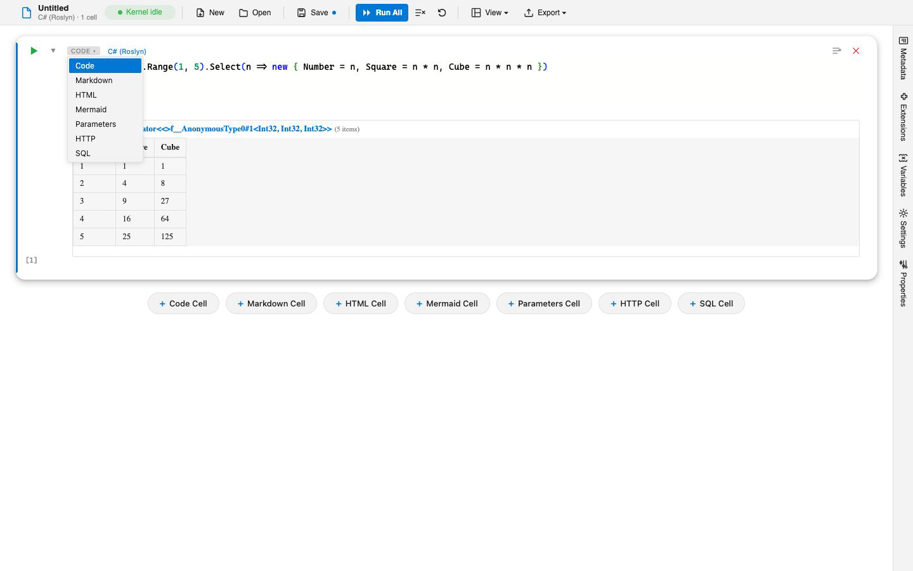

# Cell Types

A notebook is a list of cells, and each cell has a type that decides how it is edited and what running it does. Code cells run in a language kernel; other cell types render content or provide a form. This guide covers the built-in types.

## The built-in types

| Type | Runs? | What it does |
|------|-------|--------------|
| Code | Yes | Executes source in the cell's chosen language kernel and shows the result. This is the default cell type; pick its language from the cell's language picker. |
| Markdown | No | Renders Markdown prose. The source collapses to the formatted text once rendered. |
| Parameters | No | Shows a form for the notebook's parameters instead of code. See [Notebook Parameters](notebook-parameters.md). |
| SQL | Yes | Runs a SQL query against a connected database and renders the result set as a table. See [Database Connectivity](database-connectivity.md). |
| HTTP | Yes | Sends REST requests and renders the response. See [HTTP Requests](http-requests.md). |
| Mermaid | Yes | Renders a Mermaid diagram from its source, with notebook-variable substitution. See [Mermaid Diagrams](mermaid-diagrams.md). |
| HTML | Yes | Renders raw HTML you write in the cell. |

Code cells are the general-purpose type and cover every installed [language kernel](language-kernels.md). The SQL, HTTP, Mermaid, and HTML types are focused cells that pair an editor with a purpose-built renderer, so they start with helpful default content, such as a `SELECT` skeleton for SQL or a starter diagram for Mermaid.

## Math in Markdown cells

Markdown cells understand TeX math. Wrap an inline formula in single dollars, `$E = mc^2$`, and a display equation in double dollars on lines of its own; the `\(...\)` and `\[...\]` delimiters work too. Formulas are typeset with KaTeX when the cell renders, and the same happens in exported HTML. A dollar amount such as `$5` stays ordinary text, and a dollar sign inside inline code or a fenced block stays code.

## Adding and changing cells

Add a cell with the insert control between cells, then set its type. The type picker lists Code and Markdown first, followed by every other cell type an installed extension provides, so adding an extension can add new cell types to the menu.

## A note on imported "raw" cells

Importing a Jupyter notebook can produce `raw` cells. These come in as inert, non-executable text so nothing is lost on import, but `raw` is not a type you pick from the cell menu when authoring. See [Migrating from Jupyter](../migration/from-jupyter.md).

## See also

- [Language Kernels](language-kernels.md)
- [Markdown Notebooks](markdown-notebooks.md)
- [Notebook Parameters](notebook-parameters.md)
- [Database Connectivity](database-connectivity.md), [HTTP Requests](http-requests.md), [Mermaid Diagrams](mermaid-diagrams.md)
