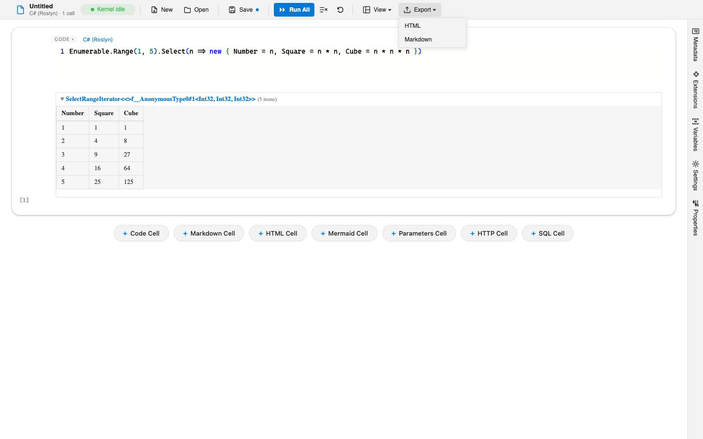

# CLI Reference

The `verso` command-line tool launches the editor, runs notebooks headlessly for CI, converts between formats, and drops into an interactive prompt. It ships every built-in kernel, theme, formatter, and serializer, so anything you can do in the editor you can do from the terminal.

## Installation

Verso is a .NET global tool:

```bash
# Install
dotnet tool install -g Verso.Cli

# Update later
dotnet tool update -g Verso.Cli
```

It requires the .NET 8.0 SDK or later. After installing, `verso --help` lists the commands, and every command has its own `--help`.

## verso serve

Launches the editor as a local web app and opens it in your browser.

```bash
verso serve                       # empty editor
verso serve my-notebook.verso     # open a notebook on launch
verso serve --port 8080           # custom port
```

| Option | Default | Description |
|--------|---------|-------------|
| `<notebook>` | none | A `.verso`, `.ipynb`, `.md`, or `.dib` file to open on launch |
| `--port` | 5050 | TCP port for the local server |
| `--no-browser` | false | Do not open a browser automatically |
| `--no-https` | false | Serve over HTTP only |
| `--extensions <dir>` | none | Extra directory to scan for extension assemblies |
| `--preserve-format` | false | Save a loaded `.ipynb` back to `.ipynb` instead of converting to `.verso` |
| `--verbose` | false | Detailed startup logging |

A loaded `.md` file saves back to `.md` without `--preserve-format`, since that format is chosen by default when it can be. See [Markdown Notebooks](markdown-notebooks.md).

## verso run

Executes a notebook headlessly and streams cell outputs to the terminal. This is the command for CI pipelines and scheduled jobs.

```bash
verso run pipeline.verso
verso run pipeline.verso --param region=us-east --param date=2024-01-01
verso run pipeline.verso --output json --output-file results.json --fail-fast
```

| Option | Default | Description |
|--------|---------|-------------|
| `<notebook>` | required | A `.verso`, `.ipynb`, `.md`, or `.dib` file |
| `--param <name=value>` | none | Set a notebook parameter (repeatable) |
| `--output <format>` | `text` | `text`, `json`, or `none` |
| `--output-file <path>` | none | Write output to a file instead of stdout |
| `--cell <id-or-index>` | none | Execute only the given cell (repeatable) |
| `--fail-fast` | false | Stop on the first cell failure |
| `--fail-on-stderr` | false | Count output written to standard error as a cell failure |
| `--timeout <seconds>` | 300 | Maximum total execution time |
| `--save` | false | Write updated outputs back to the notebook file |
| `--interactive` | false | Prompt for missing required parameters on stdin |
| `--include-markdown` | false | Include rendered markdown in the output |
| `--show-parameters` | false | Print resolved parameter values |
| `--extensions <dir>` | none | Extra directory to scan for extension assemblies |
| `--python <path>` | discovered | Interpreter to run Python cells in, overriding discovery |
| `--auto-install` | false | Install Python packages a cell imports but the environment lacks |

See [Notebook Parameters](notebook-parameters.md) for how `--param` values are typed and validated.

### Python cells in a pipeline

`--python` names the interpreter directly, which is worth doing in CI even when discovery would find the right one, because it pins what the run executes rather than leaving it to whatever the build image happens to carry. Without it, the interpreter comes from the usual search described in [Python Interpreters](python-interpreters.md).

Nothing is installed unless you ask. `verso run` uses the `off` install policy, so an import of a package the environment lacks fails the cell rather than reaching for a package index mid-pipeline. `--auto-install` selects the `auto` policy, which installs distributions Verso recognizes and reports, without installing, any name it could only guess at. See [Python Packages](python-packages.md).

### What counts as a failure

A cell fails when it produces an error. Text written to standard error does not fail it on its own, because a great deal of ordinary output arrives there: logging handlers, progress bars, and framework warnings all write to standard error while working exactly as intended.

Pass `--fail-on-stderr` when you want the stricter reading, which is worth having in a pipeline whose whole purpose is to catch warnings. It affects the exit code and the counts in both the printed and the JSON summary, so a pipeline that relied on standard error failing a cell needs this flag to keep doing so.

## verso convert

Translates a notebook from one format to another. It does not execute cells.

```bash
verso convert notebook.ipynb --to verso
verso convert notebook.verso --to ipynb --output exported.ipynb
verso convert article.md --to verso
verso convert notebook.verso --to md --output article.md
verso convert notebook.verso --to verso --strip-outputs
```

| Option | Default | Description |
|--------|---------|-------------|
| `<input>` | required | A `.verso`, `.ipynb`, `.md`, or `.dib` file |
| `--to <format>` | required | Target format: `verso`, `ipynb`, or `md` (`.dib` is import-only) |
| `--output <path>` | sibling file | Output path |
| `--strip-outputs` | false | Remove all cell outputs before writing |
| `--extensions <dir>` | none | Extra directory to scan for extension assemblies |

Converting to `md` writes plain Markdown, which carries no cell outputs, so a notebook converted that way keeps its cells and loses its results. See [Markdown Notebooks](markdown-notebooks.md).

## verso repl

Starts an interactive read-eval-print loop backed by the same engine as the editor. Every registered kernel, theme, formatter, and export action is usable at the prompt.

```bash
verso repl                          # scratch notebook, C# by default
verso repl pipeline.verso --execute # load, run, then hand over the prompt
verso repl --kernel fsharp          # start in F#
verso repl --list-kernels           # print kernels and exit
```

| Option | Default | Description |
|--------|---------|-------------|
| `<notebook>` | none | A file to load on launch |
| `--kernel <id>` | `csharp` | Active kernel for the first cell |
| `--execute`, `-x` | false | Run the loaded notebook before handing over the prompt |
| `--theme <name>` | none | Active theme, matched by display name |
| `--layout <id>` | none | Default layout id for `.export` |
| `--extensions <dir>` | none | Extra directory to scan for extension assemblies |
| `--plain` | false | Line-oriented fallback prompt (blank line submits, `;;` force-submits) |
| `--no-color` | false | Disable ANSI styling |
| `--list-kernels` / `--list-themes` | false | Print registered kernels or themes and exit |
| `--preserve-format` | false | `.save` writes a loaded `.ipynb` back in place instead of converting (a loaded `.md` already does) |

Meta-commands start with a dot. Type `.help` for the full list; common ones include `.kernel` (switch language), `.vars` (list shared variables), `.save` / `.load`, `.export`, and `.rerun`. In the default prompt, a cell submits after a blank line; in `--plain` mode a blank line submits and `;;` force-submits.

## verso export

Renders a notebook through a registered export action (any toolbar action placed in the export menu, such as HTML export). `--format` matches an action by its display name. The same export actions appear in the editor's Export menu:



```bash
verso export notebook.verso --format html --output out.html
verso export notebook.verso --format html --theme verso-dark --execute -o out.html
verso export --list           # list available export formats
```

| Option | Default | Description |
|--------|---------|-------------|
| `<input>` | required | A `.verso`, `.ipynb`, `.md`, or `.dib` file |
| `--format`, `-f <name>` | required | Display name of an export action |
| `--output`, `-o <path>` | action default | Output file path |
| `--execute`, `-x` | false | Execute the notebook first so outputs are fresh |
| `--layout <id>` | none | Layout applied during export |
| `--theme <name>` | none | Theme matched by display name |
| `--list` | false | List export actions and exit |

Export formats come from extensions, so installing an extension that adds an export action makes a new `--format` available.

## verso info

Prints the CLI version, .NET runtime, engine version, and every discovered extension, serializer, and formatter. Useful for confirming which kernels and extensions are available in the current environment.

```bash
verso info
```

## Exit codes

`verso run` (and the other commands) return deterministic exit codes so CI can branch on them:

| Code | Meaning |
|------|---------|
| 0 | All executed cells succeeded, or a clean REPL exit |
| 1 | One or more cells failed, or a fatal error outside a cell |
| 2 | Execution timed out |
| 3 | Notebook file not found or unreadable |
| 4 | Serialization error (invalid notebook format) |
| 5 | Missing required notebook parameters |
| 6 | REPL kernel or theme resolution failed |

## CI/CD

A typical GitHub Actions step installs the tool and runs a notebook, failing the job on any cell error:

```yaml
- name: Install Verso CLI
  run: dotnet tool install -g Verso.Cli

- name: Run notebook
  run: verso run tests/integration.verso --output json --output-file results.json --fail-fast
```

Combine `--param` with a build matrix to run the same notebook across many inputs. See [Notebook Parameters](notebook-parameters.md) for the details, and [Managing Extensions](managing-extensions.md) for loading extra extensions in a pipeline with `--extensions`.
