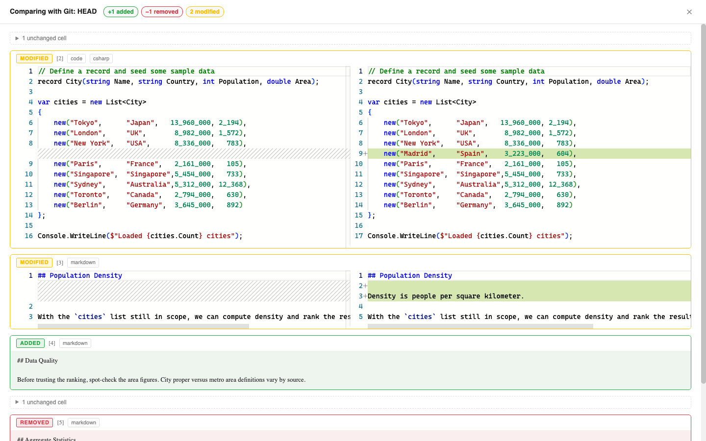

# Comparing Notebooks

Verso can compare the notebook you have open, including unsaved edits, against an earlier version. Instead of a raw JSON diff, you see which cells were added, removed, edited, or moved, and where they are: the cells themselves are marked while a comparison is live, and a full diff view gives you side-by-side source and rendered output per cell.

## Opening a comparison

Open the **Compare** panel from the panel toggles at the right of the toolbar and pick a baseline:

- **Last Saved** compares your in-memory edits against the file on disk, answering "what have I changed since I saved?"
- **Git: HEAD** compares against the committed version of the notebook file. Available when the file is inside a git repository.
- **Git: Compare with Ref...** compares against any branch, tag, or commit.
- **Choose File...** compares against another notebook file on disk (.verso, .ipynb, or .dib).

In VS Code, the same comparison is available from the command palette as **Verso: Compare Notebook with...** and from the diff icon in the editor title bar; both open the panel. The git-based baselines use VS Code's built-in git support; in editors without it, those options are simply unavailable and the file-based baselines still work.

## Walking the changes

While a comparison is live, the panel lists every change and the notebook marks the cells behind them with a colored stripe: green for added, amber for modified, blue for moved. Clicking a change in the list scrolls the notebook to that cell, so you read the change with its surroundings rather than in isolation.

A removed cell no longer exists in the notebook, so there is nothing to scroll to. Those rows expand in the panel to show the baseline source in place.

The comparison stays in effect until you press **Stop**, including while you keep editing. Closing the panel does not end it; the marks stay and the toggle keeps a dot. Restarting the kernel does end it, because the result no longer describes the live notebook.

## Reading the diff

**Open full diff** shows the whole comparison with source side by side. It covers the cells but leaves the toolbar and the panel visible, so the change list is still there when you close it. Use the up and down buttons in its header, or Alt+Up and Alt+Down, to step between changes; Escape closes it.

The view lists cells in the current notebook's order:

- **Modified** cells show a side-by-side source comparison. When a cell's outputs changed, an **Outputs changed** section expands to show the old and new rendered outputs (tables, charts, HTML) next to each other.
- **Added** and **Removed** cells show their full source tinted green or red. Removed cells appear near where they used to live.
- **Moved** cells kept their content but changed position; the header shows the old and new positions.
- Runs of unchanged cells collapse into a single row you can expand.

Notebook-level settings changes are listed at the top: title, default kernel, layout, theme, extension requirements, parameter definitions, extension settings, and saved layout state. Changes made through settings panes or by interactive layouts count as real changes, including ones you have not saved yet. Large values such as a layout's stored document show a shortened preview. Save-time noise such as the modified timestamp is excluded.

On very large change sets, source comparisons start collapsed and load as you expand them, keeping the view responsive.

## How cells are matched

Verso notebooks give every cell a stable identity that survives saves, so the diff can tell an edited cell apart from a deleted-plus-added pair, and can recognize a cell that merely moved. This makes Verso diffs precise where line-based tools guess.

When you compare against a Jupyter (.ipynb) or Polyglot (.dib) file, those formats do not carry Verso's cell identity, so cells are matched by content instead: exact matches align first, and remaining cells pair up only when their sources are similar enough to plausibly be an edit. Pairings made this way are marked "approximate match" in the cell header.

## Notes

- The comparison is read-only and never modifies the notebook or marks it dirty.
- The current side of the comparison is the live notebook, so unsaved edits are included by design.
- A comparison against a file that is not tracked at the chosen git ref reports a short notice; commit the file or pick a different ref.
