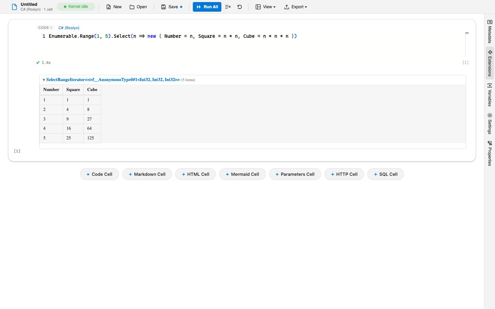
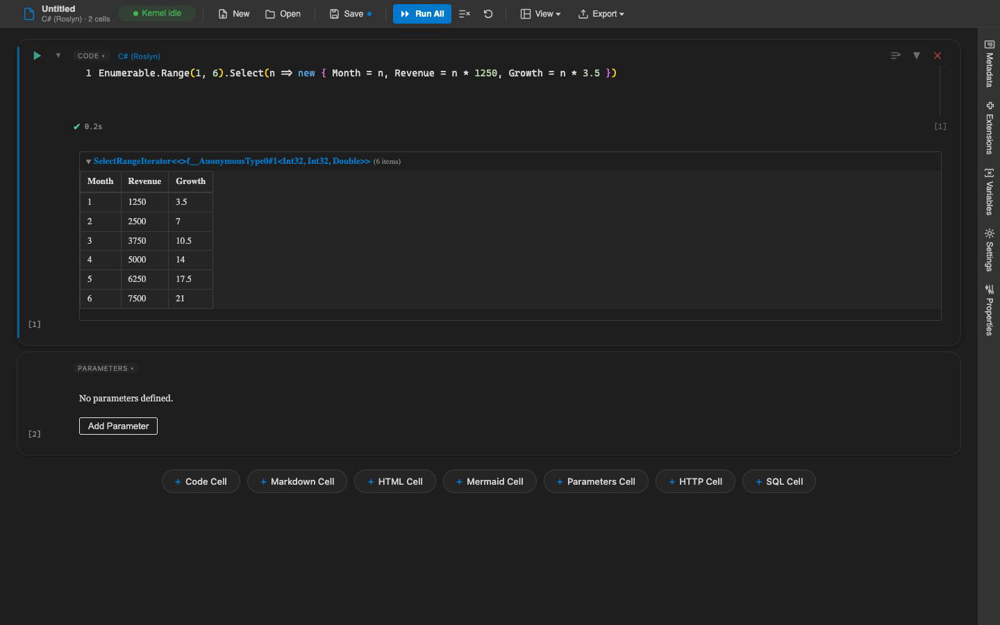

# Getting Started with Verso

Verso is an interactive notebook platform for .NET. You write cells in C#, F#, Python, JavaScript, PowerShell, SQL, and more, run them, and see rich output inline, all in a single notebook where every language shares the same variables. This guide gets you from nothing to a running notebook.

## Install Verso

There are two ways to run Verso. Pick whichever fits how you work; they open the same notebooks.

### VS Code

Install the **Verso Notebook** extension (`datafication.verso-notebook`) from the VS Code Marketplace. Once it is installed you can open any `.verso`, `.ipynb`, or `.dib` file and it renders as a Verso notebook, or run the **Verso: New Notebook** command from the command palette to start a fresh one.

### Command line

Verso is also a .NET global tool. It needs the .NET 8.0 SDK or later:

```bash
dotnet tool install -g Verso.Cli
```

Launch the editor in your browser with:

```bash
verso serve                 # start empty
verso serve my-notebook.verso   # open a file
```

The [CLI Reference](cli-reference.md) covers the other commands, including running notebooks headlessly for CI.

## Your first notebook

A notebook is a list of cells. A **code cell** holds code in one language; running it executes the code and shows the result below the cell.

1. Add a code cell.
2. Choose its language from the language picker in the cell (C# is the default).
3. Type an expression and run the cell using the run button in the cell, or run everything with **Run All** in the toolbar.

```csharp
var total = 2 + 40;
total
```

The last expression's value is displayed as the cell's output. Objects, collections, tables, images, and HTML all render richly rather than as plain text.



## Mixing languages

The reason to reach for Verso is that a notebook is not tied to one language. Add a second code cell, switch its language, and it shares state with the first. Every kernel reads and writes one shared variable store, so a value set in C# is immediately visible in Python, F#, SQL, and the rest:

```csharp
// C# cell
var city = "Portland";
```

```python
# Python cell
print(f"Hello from {city}")
```

No export or import step is needed. See [Language Kernels](language-kernels.md) for the full list of languages and how variable sharing works.

## Adding packages

Each language pulls in dependencies with a short directive at the top of a cell:

- .NET (C# and F#): `#!nuget Newtonsoft.Json`
- Python: `#!pip requests`
- JavaScript and TypeScript: `#!npm lodash`

## Beyond code

Notebooks hold more than code. Markdown cells document your work, and dedicated cell types cover common tasks: SQL queries, HTTP requests, Mermaid diagrams, and HTML. See [Cell Types](cell-types.md) for the full set.

You can also arrange a notebook as a dashboard or a presentation instead of a linear document. See [Layouts and Showcase Extensions](layouts.md).

A theme restyles the whole app, cells, outputs, and panels alike. Switch to a dark theme from the View menu:



## Next steps

- [Cell Types](cell-types.md) and [Language Kernels](language-kernels.md) for what you can put in a notebook
- [Notebook Parameters](notebook-parameters.md) to turn a notebook into a reusable, parameterized template
- [Managing Extensions](managing-extensions.md) to add kernels, layouts, and themes from the in-app marketplace
- [CLI Reference](cli-reference.md) to run and export notebooks from the terminal
