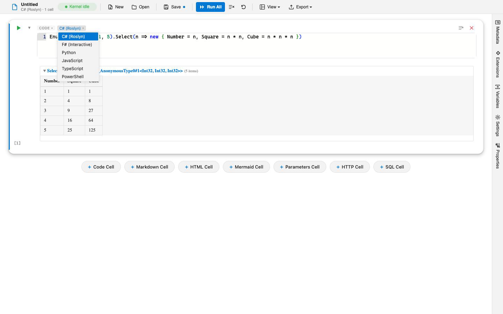
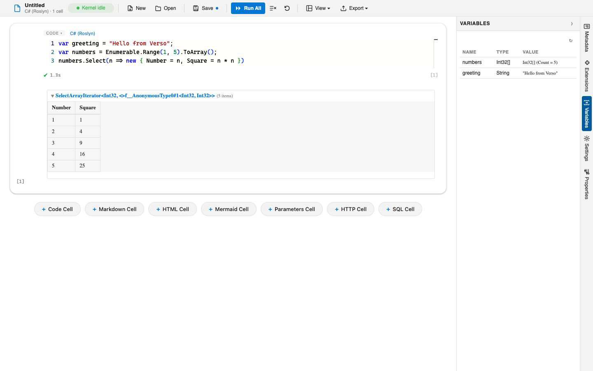

# Language Kernels

A kernel is what executes a code cell in a given language. Verso ships kernels for several languages, and more can be added as extensions. Every kernel in a notebook shares one variable store, so you can move between languages in a single document without any explicit hand-off.

## Built-in languages

| Language | Cell language id | File extensions |
|----------|------------------|-----------------|
| C# (Roslyn scripting) | `csharp` | `.cs`, `.csx` |
| F# (F# Interactive) | `fsharp` | `.fs`, `.fsx` |
| Python (your installed interpreter, 3.8+) | `python` | `.py` |
| JavaScript (Jint) | `javascript` | `.js`, `.mjs` |
| TypeScript (Jint) | `typescript` | `.ts`, `.tsx` |
| PowerShell | `powershell` | `.ps1`, `.psm1` |
| SQL (ADO.NET, multi-provider) | `sql` | `.sql` |
| HTTP (REST client) | `http` | `.http`, `.rest` |

You can install additional kernels from the marketplace. See [Managing Extensions](managing-extensions.md).

## Choosing a cell's language

A code cell shows a language picker listing every registered kernel. Change it to run that cell in a different language. New notebooks default to C#, or to the notebook's `defaultKernel` if one is set.



## Installing packages

Each language brings in dependencies with a short directive at the top of a cell:

| Language | Directive | Example |
|----------|-----------|---------|
| C# and F# | `#!nuget` | `#!nuget Newtonsoft.Json` (add a version with `#!nuget Newtonsoft.Json, 13.0.3`) |
| Python | `#!pip` | `#!pip requests` |
| JavaScript and TypeScript | `#!npm` | `#!npm lodash` |

PowerShell has no dedicated directive; install modules with ordinary PowerShell code such as `Install-Module`. SQL connects to a database with `#!sql-connect` (see [Database Connectivity](database-connectivity.md)), and HTTP configures a base URL and headers with `#!http-set-base` and friends (see [HTTP Requests](http-requests.md)).

Python cells can also install on demand: importing a package the environment does not have offers to install it first. See [Python Packages](python-packages.md).

Whichever directive runs, the cell reports what arrived rather than relaying the installer's own narration of getting there:

```
Installed lodash 4.17.23 and 2 dependencies.
```

That output is saved with the notebook, so whoever opens the file next sees it too. To name every package instead of counting the ones that came along, clear **Hide Installation Output** under Packages in the notebook's settings, in the Python or JavaScript group depending on which installs you want the detail for. An install that fails is always reported in full, and so is anything an audit found.

### Packages that carry native libraries

Some packages ship a native binary beside their managed assemblies, as plotting and database libraries commonly do. Verso resolves those against the package that asked for them, so a library of the same name sitting elsewhere on the machine is not picked up in its place, and a package whose native ships in a separately versioned companion package still finds it. Selection also follows the running process rather than the machine, which is what makes a session work under architecture emulation or on a musl based distribution such as Alpine.

Nothing needs to be configured for this. It is worth knowing only because a native load failure that used to look like the package's fault, a version mismatch naming a library the notebook never asked for, is usually not one.

## Sharing variables across languages

All kernels in a notebook share a single variable store. There is no per-kernel isolation: a variable set in one language is immediately readable in every other. This is the feature that makes a mixed-language notebook worthwhile.

The one exception is that a variable whose name begins with a double underscore does not reach Python cells, because Python reserves that prefix for names the interpreter itself owns. A single leading underscore is fine, so a C# variable named `_rowCount` still arrives.

```csharp
// C# cell
var rows = LoadData();      // returns some collection
```

```python
# Python cell, later in the same notebook
print(len(rows))
```

In C# and F#, notebook variables appear as ordinary top-level variables. You can also read and write the store explicitly:

```csharp
Variables.Set("threshold", 0.9);
var t = Variables.Get<double>("threshold");
```



SQL cells resolve `@name` bindings from the same store, and the HTTP kernel writes its last response back into it. Because the store is shared, a query result loaded in one cell can be charted, transformed, or exported by a cell in another language.

### What a value looks like in a Python cell

Python runs in its own process, so a value reaches it as data rather than as the original object. Most of that is invisible: numbers, text, lists, and dictionaries arrive as themselves.

An object with named fields, such as a C# or F# record, arrives as a mapping that answers both spellings, so either of these works:

```python
first = readings[0]
print(first.Time, first["Price"])
```

A date arrives as a real `datetime`, so it behaves normally with `pandas` and with date arithmetic. It also answers the field names used in .NET, which means a cell written for an earlier version of Verso keeps working:

```python
print(reading.Time.year, reading.Time.Year)          # both 2026
print(reading.Time.microsecond, reading.Time.Millisecond)
```

A SQL result arrives as a list of row mappings, which is what a DataFrame is built from directly:

```python
import pandas as pd
df = pd.DataFrame(lastSqlResult)
```

Exact decimals stay exact rather than becoming floats, and `Guid`, `TimeSpan`, and byte arrays arrive as `uuid.UUID`, `timedelta`, and `bytes`. Going the other way, `datetime`, `Decimal`, `UUID`, `bytes`, NumPy arrays, and pandas frames and series all convert back.

### When a value cannot cross

Some values have no meaning outside the process that made them: a function, a task in flight, an open connection, a type description. These do not silently disappear. The name is still defined, printing it explains what happened, and using it raises an error saying which variable it was and why:

```python
print(callback)
# <callback was not shared with Python: a function, which cannot be called from another process>
```

The cell that first encounters one also says so in its output. The value remains fully available to cells in the language that produced it.

Changes made in Python are shared when you assign the name. Modifying a shared collection in place, such as appending to a list that came from another language, is not reported back; assign the result to the name instead.

### Plots and widgets in a Python cell

A Python cell shows whatever the value knows how to render itself as: HTML, Markdown, SVG, images, and JSON all display directly, and a matplotlib figure appears at `show()` or at the end of the cell.

Libraries built on `ipywidgets` are handled too. These are the ones that draw nothing on their own and instead hand the notebook a reference to a model, which is why a cell that ends in `plot.display()` would otherwise print something like `Plot(antialias=3, axes=['x', 'y', 'z'], ...)` instead of a picture. Verso gives the widget a frame of its own in the cell so it draws, and keeps the interpreter behind it so a control that is moved reaches the Python that made it:

```python
import k3d
import numpy as np

plot = k3d.plot()
plot += k3d.points(np.random.randn(5000, 3).astype(np.float32), point_size=0.03)
plot.display()
```

This covers the libraries that render only as widgets, among them k3d, ipyleaflet, pythreejs, bqplot, and ipyvolume, and it covers anything built with `anywidget`. Libraries that already produce HTML, such as plotly and bokeh, never needed it and are unaffected. Nothing has to be installed for this: `ipywidgets` is already present whenever one of these libraries is, and a cell falls back to the plain description if it is somehow missing.

Two things are worth knowing before leaning on it:

- **The drawing code is fetched when the widget is shown.** The state travels in the notebook but the JavaScript that draws it comes from a public CDN, so a machine with no network shows an empty frame. The rest of the notebook is unaffected.
- **The state is saved with the notebook.** Reopening the file draws the widget again without re-running the cell, which is the point, but it does make the file bigger. A five thousand point scatter adds roughly 90 KB each time the cell is run and saved. A widget drawn from a saved file is a picture that still moves rather than a control with a kernel behind it, and it says so beneath itself until the cell is run again.

A widget's value can also become a notebook variable, which is what puts a control in front of a computation written in another language:

```
#!bind slider.value as threshold
```

```csharp
// a C# cell, later in the notebook
var cutoff = Variables.Get<long>("threshold");
```

Dragging the slider changes what that cell computes on its next run, and setting `threshold` from C# moves the slider. See [Interactive Widgets](interactive-widgets.md) for the whole of this: what makes a widget live, what a saved file holds, and the rest of `#!bind`.

## Restarting a kernel

Kernels initialize lazily the first time you run a cell in that language. If a kernel gets into a bad state, restart it to clear its variables and reload. A full "Run All" also resets the kernels first, so it behaves as if the notebook were being executed from scratch.

## See also

- [Python Interpreters](python-interpreters.md) and [Python Packages](python-packages.md)
- [Interactive Widgets](interactive-widgets.md)
- [Cell Types](cell-types.md) and [Markdown Notebooks](markdown-notebooks.md)
- [HTTP Requests](http-requests.md) and [Database Connectivity](database-connectivity.md)
- [Notebook Parameters](notebook-parameters.md)
