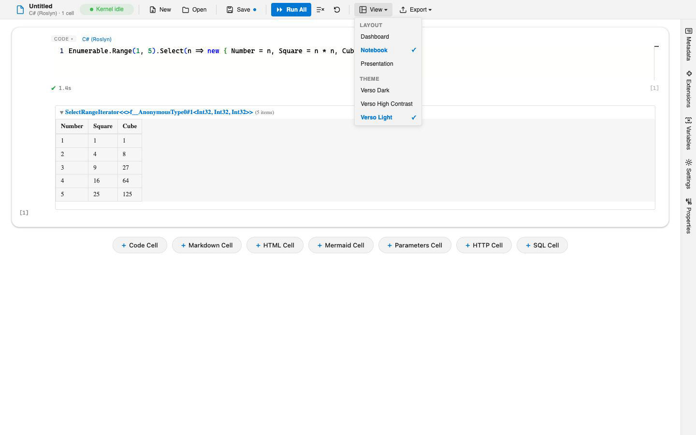
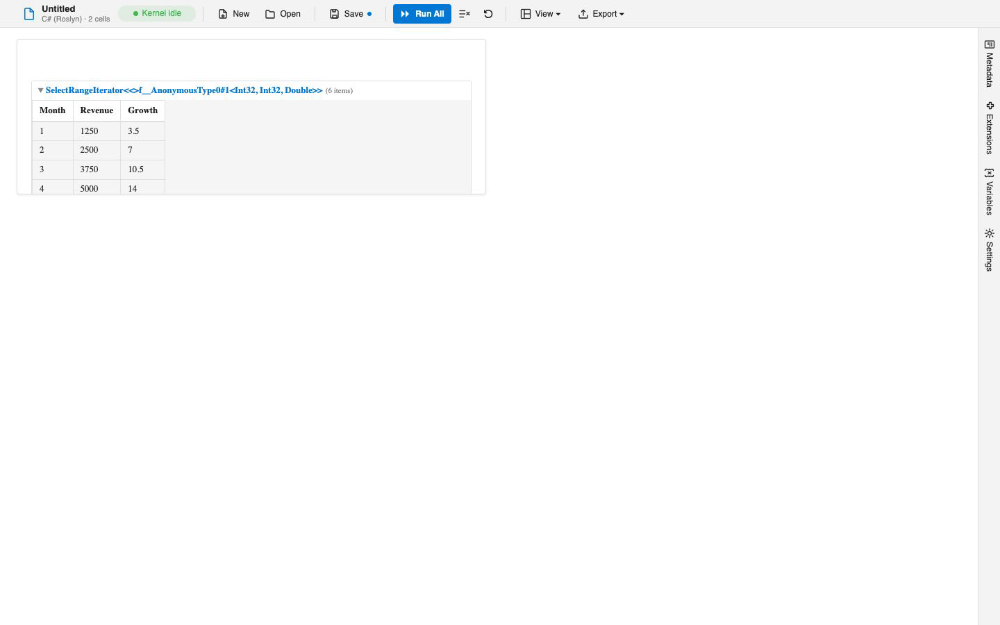

# Layouts and Showcase Extensions

A layout decides how a notebook's cells are arranged and rendered. The same notebook can be a linear document, a dashboard of tiles, or a slide deck, just by switching layouts. Layouts are extensions, so beyond the built-in ones you can install richer layouts from the marketplace.

## Built-in layouts

Verso ships three layouts, chosen from the **View** panel, which you open from the panel toggles at the right of the toolbar:

- **Notebook** is the default: a linear, top-to-bottom list of editable cells.
- **Dashboard** is a view-and-arrange grid. Cells become tiles you can move, resize, and run, but you do not edit their code here. It is meant for presenting results, not authoring them.
- **Presentation** turns the notebook into a read-only, output-focused flow that hides the editing chrome, useful for walking through results.

The panel stays open while you switch, so you can try each layout and watch the notebook redraw beside the list. Switching layouts does not change your cells or their outputs; it only changes how they are arranged. Each layout remembers its own arrangement in the notebook, so moving tiles around in Dashboard does not disturb the Notebook view.

## Installing more layouts

Layouts from the marketplace install like any other extension. Some are **isolated layouts**: they render inside a sandboxed frame, which lets them ship a self-contained interactive UI (a canvas editor, a spreadsheet, a form builder) while staying safely separated from the rest of the app. See [Managing Extensions](managing-extensions.md) for installing and trusting extensions.

Because a layout can come from an extension, a notebook that depends on one can declare it as a required extension so it loads before the notebook renders. That way the notebook opens straight into its intended layout rather than falling back to the built-in one.

## Showcase layouts

The Verso samples include several showcase layout extensions that demonstrate what an isolated layout can do. Each binds to kernel variables and stays in sync with them:

- **Form Studio** is a drag-and-drop dashboard builder. Input widgets write values back into kernel variables, and charts bound to a data variable (a `DataBlock` from `Datafication.Core` or a `System.Data.DataTable`, such as shared SQL results) update as it changes.
- **Grid Studio** presents an editable, spreadsheet-style grid that is two-way bound to a `DataBlock` variable, with type-aware columns. `DataTable` variables display as read-only grids.
- **Image Studio** is a layered image compositor with a canvas, a layer panel, and a tool palette, persisting its state into the notebook.

These show the range of the layout system: an isolated layout is a full interactive surface that communicates with your notebook's kernels through a defined bridge, not just a static arrangement of cells.

## Authoring your own

If you want to build a layout rather than use one, the [Layout Authoring Guide](../extensions/layouts.md) covers both inline and isolated layouts, cell slotting, event routing, theming, and the isolated-frame contract.

## See also

- [Managing Extensions](managing-extensions.md)
- [Layout Authoring Guide](../extensions/layouts.md)
