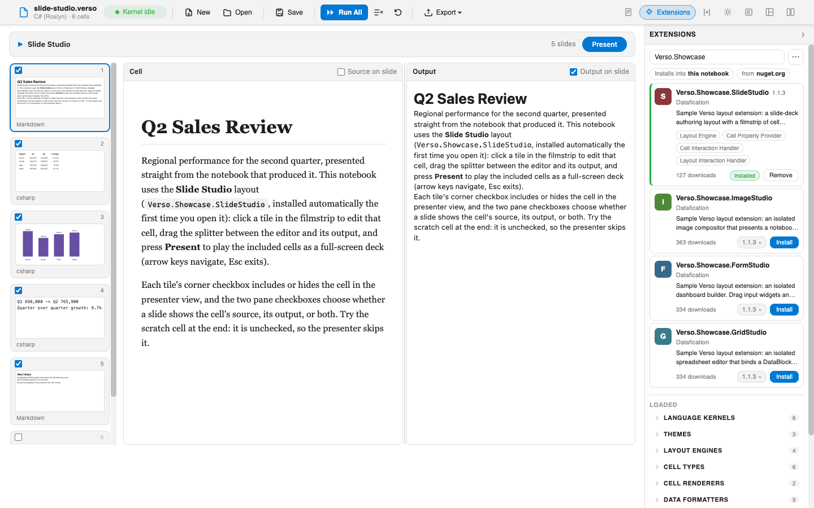

# Managing Extensions

Verso ships with a set of built-in language kernels, themes, and layouts, and every one of them is an extension. You add more the same way: from the in-app marketplace, by declaring them on a notebook, or by pointing Verso at a local build during development. This guide covers finding, installing, trusting, enabling, and requiring extensions from a user's point of view. If you want to build one, start with [Getting Started with Verso Extensions](../extensions/getting-started.md).

## The Extensions panel

Open the Extensions panel from the sidebar. It has two parts:

- A **marketplace** search box at the top. Type a package name to search, with results appearing as you type. Each result has an Install button and a version picker.
- A list of **loaded extensions**, grouped by what they provide (kernels, renderers, themes, layouts, and so on), each with an On/Off toggle.



The marketplace searches the NuGet feeds configured on your machine. If you have not customized NuGet, that means [nuget.org](https://www.nuget.org/). There is no separate Verso-only feed: any package that ships a Verso extension is installable, and any private feed in your NuGet configuration is searched too.

## Installing an extension

Search for a package, choose a version from the picker if you want something other than the latest, and select Install. The first time you install a package from NuGet, Verso asks for your consent before loading it (see [Trust and consent](#trust-and-consent) below).

Installed packages are unpacked into a managed store on disk:

- macOS and Linux: `~/.verso/extensions/<package-id>/<version>/<target-framework>/`
- Windows: `%APPDATA%\verso\extensions\<package-id>\<version>\<target-framework>\`

Each version lives in its own folder, so multiple versions can coexist. Inside a version folder, assemblies are grouped by the .NET runtime they were installed for (for example `net8.0`), so notebook hosts running on different .NET versions can share the same store. To remove an extension, use its Uninstall button. Uninstalling also revokes the package's trust, so installing it again asks for consent afresh.

## Trust and consent

Because an extension is executable code, Verso asks before it loads anything downloaded from a feed. When a package needs approval, a consent dialog lists it and lets you approve or deny. Approving loads the extension; denying leaves it installed but not loaded.

Approvals are remembered so you are not asked again on every session. Trust is pinned to the exact version you approved. If a notebook later asks for a different version of the same package, Verso prompts again rather than silently trusting the new build.

Loading a local assembly from a path (see [Loading during development](#loading-during-development)) does not prompt, since you are pointing at your own file rather than downloading one.

## Enabling and disabling

The On/Off toggle next to a loaded extension turns it off without uninstalling it, which is handy for isolating behavior or muting an extension you do not currently need. Turning it back on re-registers whatever it provides.

Enable and disable state is a personal preference stored locally on your machine (in browser storage for the web app, or the editor's state in VS Code). It is not written into the `.verso` file and does not travel with the notebook, so disabling an extension does not affect anyone else who opens the same notebook.

## Requiring extensions for a notebook

A notebook can declare the extensions it depends on so they are present before it runs. In the `.verso` file this lives under notebook metadata:

```json
"metadata": {
  "extensions": {
    "required": ["Contoso.Verso.ChartLayout@1.2.0"],
    "optional": []
  }
}
```

Each entry is a package reference: `PackageId` or `PackageId@Version` for a marketplace package, or `local:PackageId@Version` for one loaded from the managed store. An entry with no version means "latest," which Verso resolves to a concrete version and pins on first approval.

Required extensions are resolved and loaded **before the notebook renders**, so a layout, kernel, or cell type that the notebook depends on is ready on the first paint rather than appearing a moment later. When you open a notebook:

- If a required extension is installed, trusted, and available, it loads quietly.
- If it needs approval, you get a consent prompt.
- If it cannot be found, is not approved, or the feed is unreachable with nothing cached, the notebook still opens, and Verso shows a notice that the extension could not be loaded. Any layout, kernel, or cell type it would have provided is simply absent until you resolve it.

## When an extension is unavailable

If a required extension fails to load, Verso surfaces a notice, and the Installed list flags the package with a warning icon describing why. To resolve it, install or approve the extension, then reopen the notebook or run the cell that loads it. If the notebook's chosen layout came from the missing extension, Verso falls back to a built-in layout so the notebook stays usable.

## Loading during development

You do not need to publish to a feed to try an extension you are building. Two options load one directly:

- From a notebook, use the `#!extension` magic command with a path to the compiled assembly:

  ```
  #!extension ./MyExtension/bin/Debug/net8.0/MyExtension.dll
  ```

  The path is resolved relative to the notebook's directory, and a local assembly loads without a consent prompt.

- From the CLI, point any command at a directory of extension assemblies:

  ```bash
  verso serve notebook.verso --extensions ./MyExtension/bin/Debug/net8.0/
  ```

  The `--extensions` flag works on `serve`, `run`, `repl`, `convert`, and `export`. In VS Code, set the `verso.extensionsPath` setting to the same directory.

See [Getting Started with Verso Extensions](../extensions/getting-started.md) for the development loop and [Packaging and Publishing](../extensions/packaging-and-publishing.md) for turning a build into a package others can install from the marketplace.

## See also

- [Extensions overview](../extensions/index.md)
- [Packaging and Publishing](../extensions/packaging-and-publishing.md)
- [Layouts and Showcase Extensions](layouts.md)
