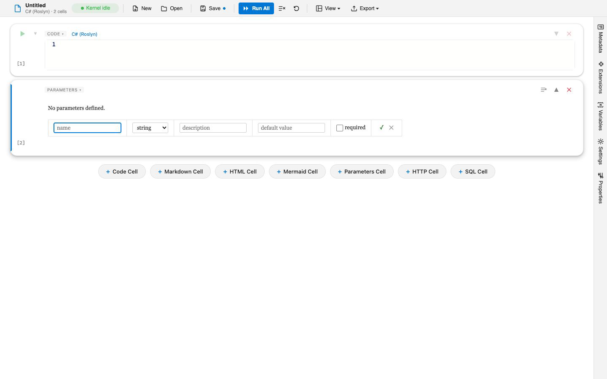

# Notebook Parameters

Parameters turn a notebook into a reusable template. You declare typed inputs, Verso injects their values into the shared variable store before any cell runs, and every kernel sees them as ordinary variables. The same notebook can then drive a CI pipeline, a scheduled job, or an ad hoc run, each with different inputs.

## Defining parameters

Parameters live in the notebook's `metadata.parameters` section. Each entry has a type and optional description, default, and required flag:

```json
{
  "verso": "1.1",
  "metadata": {
    "title": "Regional Pipeline",
    "defaultKernel": "csharp",
    "parameters": {
      "region": {
        "type": "string",
        "description": "Region to process",
        "default": "us-west-2",
        "required": true
      },
      "batchSize": {
        "type": "int",
        "default": 1000
      },
      "dryRun": {
        "type": "bool",
        "default": false
      }
    }
  }
}
```

In the editor you do not edit this JSON by hand. A **parameters cell** provides a form for adding parameters, choosing their type, and setting defaults, and it writes the same metadata.



## Supported types

Values supplied as strings (on the command line or in the form) are coerced to the declared CLR type:

| Type | CLR type | Example value |
|------|----------|---------------|
| `string` | `string` | `us-east` |
| `int` | `long` | `1000` |
| `float` | `double` | `0.95` |
| `bool` | `bool` | `true` |
| `date` | `DateOnly` | `2024-01-01` |
| `datetime` | `DateTimeOffset` | `2024-01-01T08:00:00Z` |

## Using parameters in code

Parameters are injected as typed variables in the shared store, so they are available to every kernel. In C# they appear as top-level variables:

```csharp
Console.WriteLine($"Processing {region} with batch size {batchSize}");

// Or read explicitly from the store
var region = Variables.Get<string>("region");
```

SQL cells resolve them as named bindings:

```sql
SELECT * FROM events
WHERE region = @region AND event_date = @date
```

Because they flow through the shared variable store, a value declared as a parameter is also visible to F#, Python, and the other kernels without any extra step. See the variable-sharing section of [Language Kernels](language-kernels.md) for how that store works.

## Supplying values at run time

From the CLI, pass each value with a repeatable `--param` flag:

```bash
verso run pipeline.verso --param region=us-east --param batchSize=5000
```

Add `--show-parameters` to print the resolved values, or `--interactive` to be prompted for any required parameter that is missing. In the editor, the parameters cell collects values, and "Run All" applies them.

## Required parameters

A parameter marked `"required": true` with no default must have a value before the notebook runs. From the CLI, a missing required parameter blocks execution and returns exit code 5 with a message listing what is needed:

```
Error: Missing required notebook parameters:

  date (date)     Processing date
  region (string) Region to process

Supply values with --param or use --interactive to be prompted.
```

In the editor, a required parameter without a value shows a validation error on the parameters cell when you run the notebook.

## See also

- [CLI Reference](cli-reference.md) for `verso run` and its flags
- [Migrating from Papermill](../migration/from-papermill.md) if you are moving parameterized runs from Papermill
