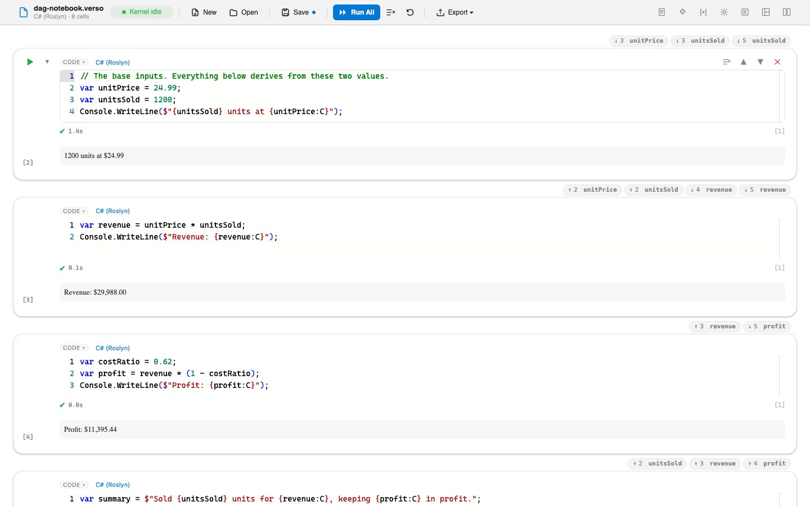

# DAG Notebook

Change a number near the top of a notebook and you have a small chore ahead of you: find every cell below that depended on it and run them, in the right order, without missing one. DAG Notebook removes the chore. It reads the notebook, works out which cells feed which, and when a cell finishes running it runs that cell's dependents for you, in dependency order.

DAG is short for **directed acyclic graph**, which is the shape those dependencies make. Each edge points one way, from the cell that produces a variable to a cell that reads it, and no path leads back to where it started. That second property is what makes the graph safe to run automatically: a notebook whose cells form a loop has no correct order to run them in, so the layout detects loops and refuses to cascade through them.

It looks almost exactly like the notebook layout, which is the point. This is an inline layout, so the cells are the real, editable cells, and the visual base is a faithful match of the built-in one. Everything the layout adds reads as an addition rather than as a different product.

The quiet claim it makes is a large one: **a layout extension can change execution semantics, not just presentation.** Reactive execution is usually a property of the notebook tool you chose. Here it arrives as a package, and nothing in the host changes to accommodate it.

## What you see

Each linked cell gets a row of chips above it. `↑ 2 unitPrice` means this cell reads `unitPrice` from cell 2. `↓ 4 revenue` means cell 4 reads `revenue` from this one. `↻ threshold` marks a variable that follows a control rather than a computation. Chips are numbered by document position and tracked by cell identity, so they survive reordering, and clicking one scrolls to the cell at the other end of the link.

A cell whose inputs ran more recently than it did draws a dashed border until it catches up. The mark appears the moment a producer starts running and clears when the cell re-runs, so with the cascade turned off the notebook still tells you what is out of date and simply waits for you.

The layout's own header carries a **Run DAG** button, which runs the whole notebook in dependency order rather than document order, and an **Auto-run dependents** toggle. The host's own Run All is untouched and keeps its normal document-order behaviour. Both coexist on purpose.

## How the graph is built

On every render the layout scans each code cell for the variables it defines, meaning assignments, functions, and type declarations, and the names it references, including names inside interpolated strings. A variable with exactly one defining cell links that producer to every cell that reads it. The scan covers C#, Python, and F#, and it is a lightweight heuristic pass rather than a proof, which the layout is careful to describe as a strong hint.

Two of the ways a cell writes a variable are not assignments at all. `#!bind` shares a widget's trait as a notebook variable, and `Variables.Get("name")` and `Variables.Set("name", ...)` reach the shared store by a name that lives inside a string. Both are read from the source before comments and string literals are stripped, and that single decision is what lets a Python control link to a C# cell instead of the graph stopping at each language boundary.

Ambiguity is surfaced rather than guessed at. A variable assigned in more than one cell produces a warning chip on every writer and no edges at all, so nothing is auto-run on a link the scan is not sure about. Cells that form a cycle are flagged and their cycle edges excluded, which means a cascade cannot loop.

## How the cascade runs

The layout declares the notebook events capability and relays the host's cell execution events into its own interaction handler. When a cell completes successfully and auto-run is on, the layout executes that cell's transitive dependents one at a time, in topological order, through the standard notebook operations. The trigger is a completed run, not a keystroke.

A batch run is not double-executed. The cascade waits a beat before starting, and any cell beginning to run inside that window cancels the pending trigger, so the host's document-order Run All completes on its own terms.

A failure stops the cascade. Cells after the failed one never run and keep their stale marker, and the failed cell gets an error border.

## A control at the top of the graph

`dag-notebook-widget.verso` is the second sample and the shorter one. A Python cell builds an `ipywidgets` slider, one `#!bind` line shares its value as a notebook variable, and two C# cells read that variable. Run **Run DAG** once, then drag the slider and let go: the two C# cells re-run on their own, in order, with nothing clicked.

This works because a variable bound to a widget trait changes when the control moves, with no cell having run at all. The layout watches the shared store for exactly those variables, treats the cell that bound one as its producer, and cascades from there. Moving a slider and finishing a run are the same event as far as the graph is concerned.

The link runs in both directions. Writing the variable from a cell with `Variables.Set("threshold", 80L)` moves the slider on the page, and readings are taken afresh whenever a cell completes, so a cell writing the variable it reads settles after one pass instead of looping.

A drag is coalesced into one run rather than one per step. The sample slider is declared with `continuous_update=False`, which holds its value until the handle is released, but even with continuous updates the cascade runs once per gesture, because a change arriving inside the coalescing window replaces the one before it.

Widgets are live in the editor, whether it is served by `verso serve` or opened in VS Code. A notebook run from the command line has no view to talk to, so there the slider draws from its saved state and the C# cells read whatever value that state holds. See [Interactive Widgets](../guides/interactive-widgets.md) for what makes a widget live and what `#!bind` does.

## Trying it

Open `dag-notebook.verso` from the sample folder. It declares `Verso.Showcase.DagNotebook` as a required extension and pins the layout, so it opens straight into it. The notebook seeds a small pricing model: two base inputs feed revenue, revenue feeds profit, and a summary cell reads all three.

Run everything once with **Run DAG**, then change `unitPrice` in the second cell and run just that cell. Revenue, profit, and the summary re-run on their own, in order. Turn **Auto-run dependents** off and repeat: the downstream cells mark themselves stale and wait. The last two cells both assign `counter` on purpose, so you can see the multi-writer warning chips and the fact that an ambiguous name is left out of the cascade.

The auto-run toggle round-trips through the layout's metadata block, so a notebook saved with it off stays off.

## Notes

A control that drives a cell which writes the same variable back is a loop the scan cannot see, because the write happens at run time rather than in the source. Taking a fresh reading of every bound variable each time a cell completes is what settles it after one pass instead.

The sample bundles no third-party libraries. The stylesheet and the script are part of the sample.

## See also

- [Showcase Extensions](overview.md)
- [Interactive Widgets](../guides/interactive-widgets.md)
- [Layout Authoring Guide](../extensions/layouts.md)
- [Source on GitHub](https://github.com/DataficationSDK/Verso/tree/main/samples/showcase/dag-notebook)
