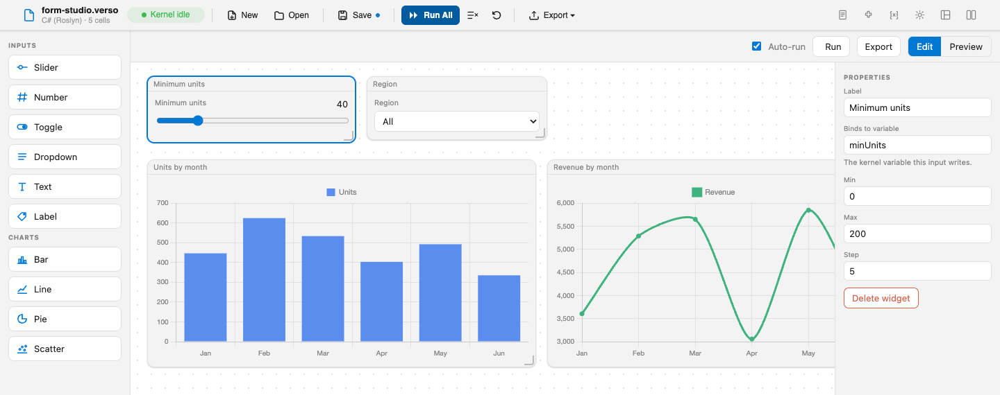
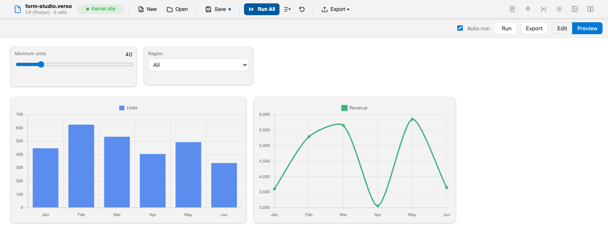

# Form Studio

Form Studio turns a notebook into a small app you can drive. Drag sliders, dropdowns, toggles, text fields, labels, and charts onto a canvas; bind each input to a kernel variable by name; then move a slider and watch the notebook's own code recompute and the charts redraw. The same file is both an editable document and a dashboard, and switching between them is a layout change.

It is an isolated layout, so the canvas runs inside the host's sandboxed frame. It pairs kernel data with [Chart.js](https://www.chartjs.org) for the charts, and a chart can plot a `DataBlock` from [Datafication.Core](https://www.nuget.org/packages/Datafication.Core) or a `System.Data.DataTable`, which is what a SQL cell shares to the variable store.

## What it shows

**A dashboard you build by dragging.** Drop widgets onto a canvas, then move and resize them in Edit mode and use them in Preview mode. The canvas you build is the layout's document, saved with the notebook.

**Inputs that write kernel variables.** Each input binds to a variable by name and writes it on change through the layout interaction handler. With auto-run on, the layout re-runs the notebook so downstream cells recompute, then pushes the fresh data back to the charts.

**Charts bound to kernel data.** A chart widget reads a `DataBlock` or a `DataTable` and plots it. Switch the chart type between bar, line, pie, doughnut, and scatter, pick the X and Y columns, and recolor the series. Those visual controls update instantly inside the frame with no kernel round trip, because they change how the data is drawn rather than what the data is.

**A third-party chart library inside a sandboxed frame.** The renderer is a single self-contained module, and Chart.js is vendored and injected at runtime with no network access inside the frame.

**Theme tracking, including on canvas.** The chrome is themed through the host's `--verso-*` CSS variables. Chart.js paints to a canvas, where CSS variables cannot reach, so the sample reads the tokens into the chart options and repaints the charts when the active theme changes. It is a small piece of work and a good illustration of where the CSS-variable approach needs a hand.

## How it works

| Piece | Responsibility |
|---|---|
| `FormStudioLayout.cs` | The layout engine, lifecycle handler, and interaction handler. Seeds the frame, writes input values to kernel variables, re-runs the notebook, and pushes chart data back. |
| `FormDocument.cs` | The persisted canvas: every widget plus the auto-run flag, kept as the frame's own JSON and parsed for the parts the C# side acts on. |
| `DataBlockReader.cs` | Reads a chart source into a serializable shape: a `DataBlock` entirely by reflection, a `DataTable` through its typed API. |
| `assets/form.js` | The frame renderer: palette, drag-and-drop canvas, properties panel, chart wiring, and the bridge. |
| `RendererScript.cs` | Assembles the single renderer module from the embedded assets at runtime. |

The flow starts with the host mounting the frame and installing the bridge. The renderer injects the chart library, registers a message handler, and announces itself as ready. The host returns the saved canvas and the list of variables that could serve as chart sources, and the frame draws the dashboard.

From there, moving an input sends its new value, and the interaction handler writes it to the bound kernel variable. Running cells raises the variable-store change event, at which point the lifecycle handler re-reads each chart's bound source and pushes it into the frame, where the matching chart updates. Structural changes, meaning adding, moving, or configuring a widget, send the whole document, which the host persists through layout metadata so the dashboard is restored when the notebook is reopened.

## The recompute loop

The notebook's compute cell reads the dashboard's inputs with `Variables.Get<T>("name")` and rebuilds the `DataBlock` the chart plots. Reading through the shared store means the cell always sees the live value the dashboard wrote, and `Get<T>` returns a sensible default before any widget is bound, so the same cell still runs correctly on its own in the notebook layout. That property is worth designing for: a dashboard that breaks the notebook underneath it is a worse dashboard.

Auto-run uses the host's execute-all operation and is debounced, so dragging a slider triggers one recompute rather than dozens. Turn auto-run off to recompute only with the **Run** button.

## Reflection, not a project reference

The extension references `Verso.Abstractions` and nothing else. It reads a `DataBlock` by reflection against whichever Core assembly the kernel loaded with `#r "nuget: ..."`, so the charts work regardless of how that assembly arrived. A `DataTable` is a type from the base class library and is read through its strongly-typed API with no reflection needed.

Form Studio only reads its chart sources. Its inputs write plain scalar variables, so there is no write-back of structured data here; that story belongs to [Grid Studio](grid-studio.md).

## Trying it

Open `form-studio.verso` from the sample folder. It declares `Verso.Showcase.FormStudio` as a required extension, so the host installs it from NuGet on open, and it carries a dashboard already built: a slider bound to `minUnits`, a dropdown bound to `region`, and two charts reading `chartData`.

Run the cells to build the `sales` and `chartData` DataBlocks, then click **Preview** and move the slider or change the region. The compute cell re-runs against the value you set and the charts redraw.

To build one from nothing, click **Edit** and drag widgets from the palette. Select a widget to bind it: an input takes the name of the kernel variable it writes, and a chart takes the name of the variable it reads, plus which column goes on each axis. Deleting the four widgets that ship with the sample and rebuilding them is a quick way to see the whole loop from the other side.

## Licensing

The sample is MIT. It bundles one MIT-licensed library verbatim, with its license text beside it: [Chart.js](https://github.com/chartjs/Chart.js) 4.4.6, the auto-registering UMD build.

## See also

- [Showcase Extensions](overview.md)
- [Grid Studio](grid-studio.md)
- [Layout Authoring Guide](../extensions/layouts.md)
- [Source on GitHub](https://github.com/DataficationSDK/Verso/tree/main/samples/showcase/form-studio)
