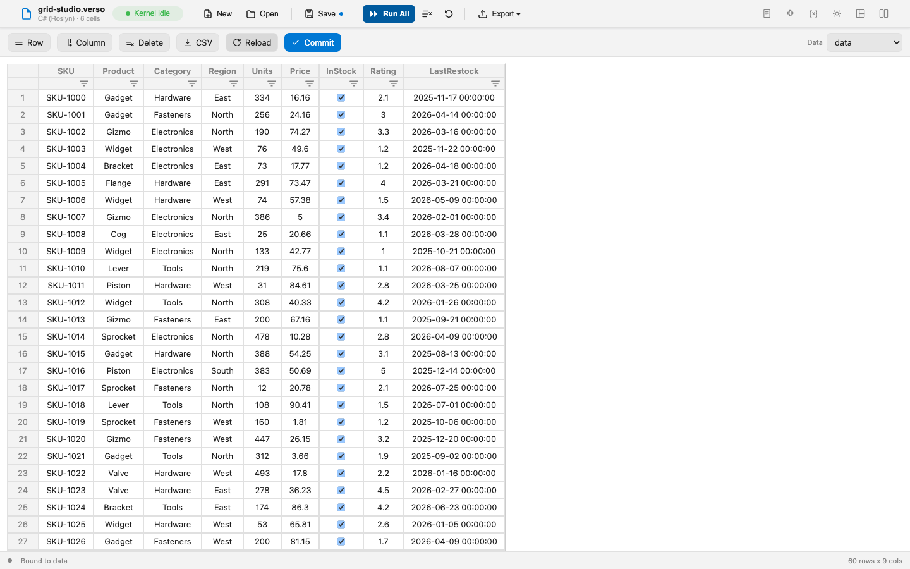

# Grid Studio

Grid Studio presents a kernel variable as an editable, Excel-like spreadsheet. Edit a cell, add a row, add a column, and the result is committed back to the same variable as a rebuilt `DataBlock` that the rest of the notebook can query. The grid is not a viewer bolted onto your data. It is another way of writing it.

It is an isolated layout: the grid surface runs inside the host's sandboxed frame, and the C# side owns the binding to the kernel variable. It pairs the `DataBlock` from [Datafication.Core](https://www.nuget.org/packages/Datafication.Core) with [Jspreadsheet CE](https://github.com/jspreadsheet/ce) for the grid itself.

## What it shows

**A DataBlock you can edit by hand.** The grid reads a `DataBlock` from the variable store and renders it. Committing an edit writes a rebuilt `DataBlock` back to the same variable, so downstream code cells see your edits the next time they run.

**Two-way binding over the variable store.** The lifecycle handler seeds the frame with the bound value and subscribes to variable changes, and the frame channel streams updates in. Commits come back through the interaction handler and are written with the variable store's own setter. Nothing in this path is private to the sample.

**Type-aware columns.** The schema drives the grid, so numeric columns edit as numbers and boolean columns as checkboxes, and the rebuilt `DataBlock` preserves those types rather than flattening everything to text.

**DataTables, viewed read-only.** Binding the grid to a `System.Data.DataTable`, such as the results a SQL cell shared to the variable store, renders it with editing disabled: no cell edits, no row or column changes, no commits. This is a deliberate refusal rather than an unfinished path. A `DataTable` can be wired to a data adapter, so writing edits back could prime a database update nobody asked for. Reload, CSV export, and the source picker all stay available.

**A third-party grid inside a sandboxed frame.** The renderer is a single self-contained module. The grid library and its helper are vendored and injected at runtime, with no network access inside the frame.

**Theme tracking.** The chrome and the grid are themed entirely through the host's `--verso-*` CSS variables, so they re-color when the active theme changes without the sample knowing a palette by name.

## How it works

| Piece | Responsibility |
|---|---|
| `GridStudioLayout.cs` | The layout engine, lifecycle handler, and interaction handler. Binds to a kernel variable, streams its contents into the frame, and writes commits back. |
| `DataBlockInterop.cs` | Reads a `DataBlock` into a serializable shape and rebuilds one from edited rows, entirely by reflection. Also reads a `DataTable` through its typed API for read-only display. |
| `GridDocument.cs` | The persisted binding, meaning which variable the grid is pointed at. |
| `assets/grid.js` | The frame renderer: a themed toolbar around the grid, plus the bridge wiring. |
| `RendererScript.cs` | Assembles the single renderer module from the embedded assets at runtime. |

The data flow is short enough to follow in one pass. The host mounts the frame and installs the bridge; the renderer injects the vendored library, registers a message handler, and announces itself as ready. The host then reads the bound source, defaulting to a variable named `data`, and returns its columns, types, and rows as initial state. When any kernel variable changes, the lifecycle handler re-reads the bound one and pushes the fresh contents, and the frame rebuilds the grid. Editing the grid sends a commit, which the interaction handler turns back into a `DataBlock`.

## Reflection, not a project reference

The extension references `Verso.Abstractions` and nothing else. It never references Datafication.Core.

It reads and rebuilds the `DataBlock` by reflection, and write-back constructs the new one using the live instance's own assembly, meaning the one the kernel loaded with `#r "nuget: ..."`. That keeps the round-trip working regardless of how and where each assembly was loaded, which is the difference between a sample that works on your machine and a package that works on everyone's.

A `DataTable` needs none of this. It is a type from the base class library, so it is read through its strongly-typed API, and only ever for display.

## Trying it

Open `grid-studio.verso` from the sample folder. It declares `Verso.Showcase.GridStudio` as a required extension, so the host installs it from NuGet on open.

1. Run the cell that builds a `DataBlock` named `data`.
2. Switch the layout to **Grid Studio** from the layout picker.
3. Edit cells, add rows or columns, then re-run a code cell to read the committed `DataBlock`.

Point the grid at a different source from the **Data** dropdown in the toolbar. It lists every variable currently holding a `DataBlock`, which are editable, or a `DataTable`, which are read-only, and it refreshes when cells run while the layout is open. To see the read-only path, run a SQL cell that shares its results to a variable: the resulting `DataTable` appears in the dropdown and opens with editing disabled.

## Licensing

The sample is MIT. It bundles two MIT-licensed libraries verbatim, with their license texts beside them: [Jspreadsheet CE](https://github.com/jspreadsheet/ce) 4.15.0 and [jsuites](https://github.com/jspreadsheet/jsuites) 5.13.3. Only the Community Edition of Jspreadsheet is used; the Pro edition is not required.

## See also

- [Showcase Extensions](overview.md)
- [Database Connectivity](../guides/database-connectivity.md)
- [Layout Authoring Guide](../extensions/layouts.md)
- [Source on GitHub](https://github.com/DataficationSDK/Verso/tree/main/samples/showcase/grid-studio)
