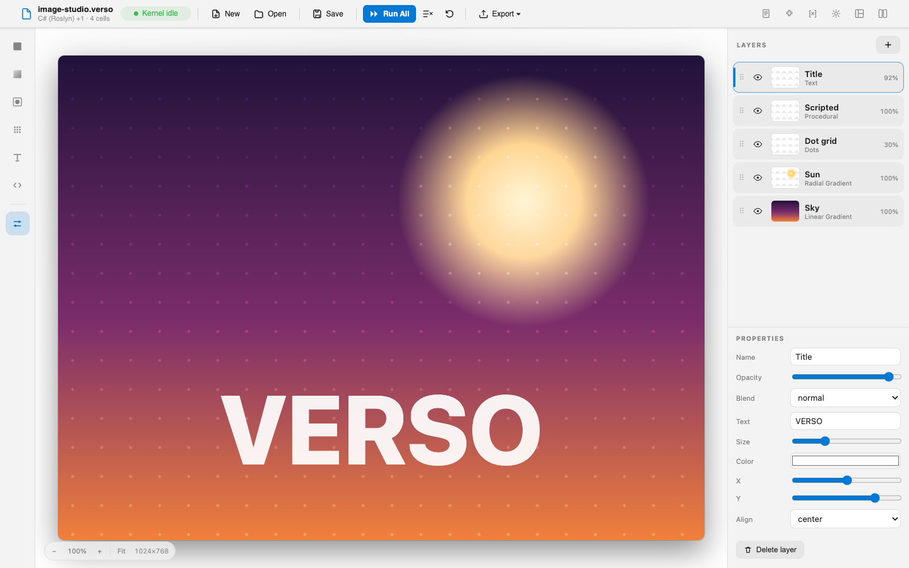
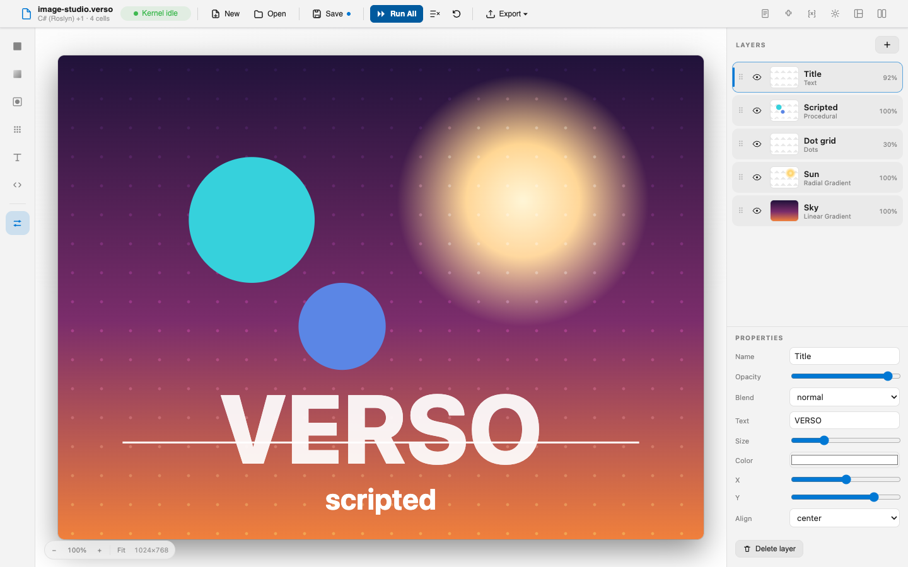

# Image Studio

Image Studio turns a notebook into a layered image compositor: a canvas in the middle, a layer panel on the right, and a tool palette on the left. Toggle a layer's visibility, drag its opacity, change its blend mode, reorder the stack, and the canvas recomposites live.

The quiet claim: **the document and the editor are the same file viewed two ways.** Open it in the notebook layout and it is a notebook. Switch to Image Studio and it is an image editor. Nothing about the file changes, and nothing about the host changes either.

It is an isolated layout, drawing with the HTML5 canvas inside the host's sandboxed frame and themed entirely through the host's `--verso-*` CSS variables, so it adapts to every Verso theme, including the ones generated from your active VS Code theme.

## How it works

**The layer stack is the layout's document.** It is persisted into the notebook's layouts block through the standard metadata round-trip that every layout has. No host changes, no sidecar file, just metadata.

**The frame owns the editor.** The C# side holds the document and streams it to the frame; the frame renders the canvas, the layer panel, and the properties, and sends edits back as layout interactions such as adding a layer, reordering, or setting an opacity or a blend mode.

**Any layer can be code.** A procedural layer defers its drawing to a kernel variable. The layout subscribes to the variable store and pushes the variable's value into the live frame whenever it changes, so editing and re-running a code cell repaints that layer immediately. This is the seam where the image editor stops being a picture of an editor and starts being a notebook: the composition has a layer whose contents are computed.

Layer kinds are solid, linear gradient, radial gradient, checkerboard, stripes, dots, rings, text, and procedural. Each layer carries its own opacity and a full set of canvas blend modes.

## Exporting

While Image Studio is the active layout it contributes **PNG Image** and **SVG Image** to the host's **Export** menu, alongside the notebook's other export formats. They are layout-scoped, so they appear here and are absent everywhere else.

PNG asks the host to deliver the rasterized composite as a download. SVG delivers the same composite as vector markup instead: because every layer is a vector primitive, the frame re-emits the stack as SVG in the document's own coordinate space, so it stays crisp at any size. Per-layer opacity maps to a group opacity and blend modes to the CSS blend property. Text falls back to a generic system font, since the theme font is not embedded, and blend modes render in browsers though some standalone SVG tools support them only partially. A host that does not support file downloads from a layout simply ignores either request.

The export buttons live in the host chrome rather than in the frame, which makes this a small demonstration of something worth knowing about: the menu action asks the isolated frame to produce the bytes, because only the frame can rasterize its own canvas, and the frame streams them back for the host to download. An isolated layout can contribute actions to the host toolbar and still do the work itself.

## Trying it

Open `image-studio.verso` from the sample folder. It declares `Verso.Showcase.ImageStudio` as a required extension and pins the layout, so it opens straight into the editor with no layout switch. You land on a seeded composition: a sunset gradient, a soft sun, a dot grid, and a title.

From there:

- Toggle a layer's visibility, drag its opacity, change its blend mode, or drag rows to reorder, and watch the canvas recomposite.
- Add layers from the tool palette, then edit their colors, angles, and positions in the properties panel.
- Add a procedural layer with the `</>` icon, then run the second code cell to drive it from the `ops` variable. Edit the instructions and re-run to repaint it live.
- Save the notebook. The layer stack is written into the file and restored the next time you open it in this layout.

## Notes

Edits made through the editor are captured when the notebook is saved, because the host reads the layout's metadata at save time.

The bar at the bottom-left of the stage zooms the canvas, through its buttons, Ctrl or Cmd with the mouse wheel, or the `+`, `-`, and `0` keys. **Fit** auto-scales the canvas to the viewport and keeps it fitted as the window or the surrounding panels resize; clicking the percentage resets to 100%. Zoomed past the viewport, the stage scrolls and a plain wheel pans.

The sample bundles no third-party libraries. The only asset is its own renderer script.

## See also

- [Showcase Extensions](overview.md)
- [Layout Authoring Guide](../extensions/layouts.md)
- [Source on GitHub](https://github.com/DataficationSDK/Verso/tree/main/samples/showcase/image-studio)
