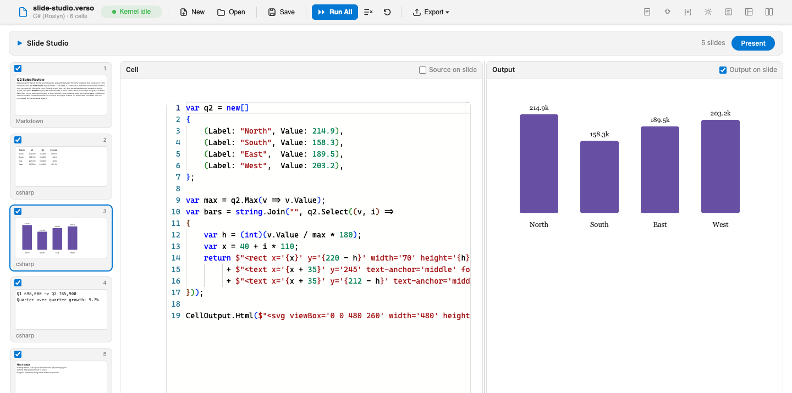
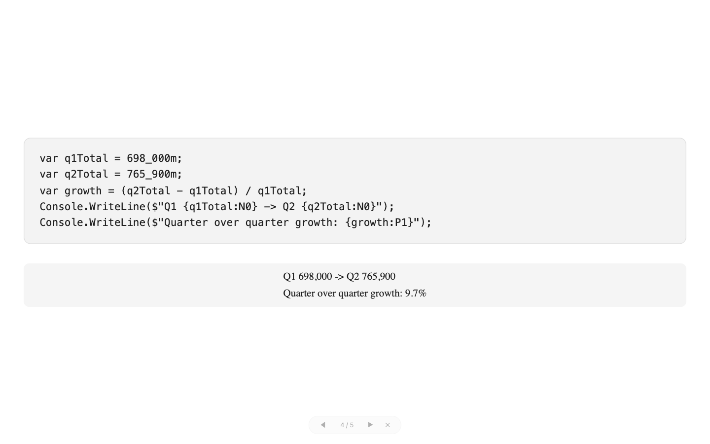

# Slide Studio

Slide Studio presents a notebook the way a slide editor presents a deck. A filmstrip of cell previews runs down the left. The selected cell's live editor and its rendered output sit side by side behind a draggable splitter. A full-screen presenter mode plays the included cells as slides.

It is an inline layout, so the editor in the middle is the real cell component, with Monaco, the run button, and everything else a cell normally has. You are not previewing a deck built from your notebook. You are editing the notebook, in a window shaped like a deck.

The quiet claim: **a layout extension can own an entire authoring workflow's chrome.** Panels, a splitter, per-cell toggles, and a presenter overlay, built on the public layout, cell interaction, and cell property extension points, with nothing reserved for first-party code.

## Three checkboxes decide the deck

Every filmstrip tile has an include checkbox. Unchecking it hides that slide, the way a hidden slide works in any deck tool, without touching the cell.

Each workspace pane has an "on slide" checkbox, choosing whether the slide shows the cell's source, its output, or both stacked. The defaults are output only: an audience sees results, and code slides opt in.

The same three switches appear in the cell properties panel as a **Presenter** section, because the layout implements the cell property provider interface as well. Both surfaces read and write the same metadata key, so it does not matter which one you reach for.

A checkbox change travels over the cell interaction channel, writes a single namespaced key into the cell's metadata, and sets the interaction's state-changed signal. That channel carries a dirty flag in every host, which is exactly why the checkboxes are routed through it: layout metadata persists on save but does not mark the document edited on its own, and a deck you rearranged should feel unsaved until you save it.

## The output you see is the real one

Layout HTML is injected with `innerHTML`, so a script inside a serialized copy of an output would never execute, and a chart library that finds its target element by id would find the copy instead of the real output. Slide Studio therefore never shows a copy.

The workspace positions the live cell's own output section over the output pane with scoped CSS. Each slide's output area is a real cell slot that the host's portal fills with the live cell, and slide styling strips the editing chrome the same way the built-in presentation layout does. The active cell is the one exception, because the editor slot claims it first: the script hands it to its slide while that slide is up and returns it afterwards.

The practical result is that script-driven, interactive, and rich outputs behave on a slide exactly as they do in the notebook. A static, script-free fallback copy sits underneath for the moments when the live element does not exist, such as while a markdown cell is being edited or when a cell's output section is collapsed, and the two states are switched between with CSS alone.

The filmstrip previews are cheaper by design. A tile renders the cell's first persisted output inside a clipped box scaled to a quarter size with pointer events off, and a cell that has never run shows a source excerpt instead. Because Verso persists outputs in the notebook file, the filmstrip is meaningful the moment the notebook opens. Script-driven HTML outputs are the exception and show an "Interactive output" placeholder, for the same reason the panes show the live element. Diagrams are the counter-example that proves the rule: a Mermaid copy is only the diagram source in the host's container markup, rendered client-side with fresh element ids, so tiles show real rendered diagrams.

## Presenting

Every render also emits the slides as a hidden overlay, so presenting and navigating are visibility switches on the client with no round trip per keypress.

Slides scale like a deck rather than reflowing like a document. Each one lays out on a fixed-width canvas that the script measures and scales to the screen with a transform, capped upward so text does not balloon and uncapped downward so oversized content always fits. If a chart settles late, the canvas refits itself.

Presenting never re-executes anything. Outputs appear as the cell last rendered them, and geometric scaling makes them fill the screen. Re-executing on Present would surprise anyone whose cells have side effects, so it is deliberately off the table; responsive outputs instead get a resize nudge when their slide appears.

Presenting requests fullscreen where the host allows it and falls back to a viewport-filling overlay where it does not, which is the case in some webviews. Esc, the browser's own fullscreen exit, and the overlay's close button all leave cleanly, and re-renders are deferred while presenting and applied on exit.

## Staying current

The layout declares the notebook events capability and asks for a debounced re-render when a cell finishes running, so the filmstrip previews and the output pane track reality rather than the state of the notebook when you switched layouts.

The selected cell, the splitter ratio, and the last presented slide round-trip through the layout's metadata in the notebook file. The splitter drag itself is entirely client-side and posts a single interaction when you let go.

## Trying it

Open `slide-studio.verso` from the sample folder. It declares `Verso.Showcase.SlideStudio` as a required extension, so the host installs it from NuGet and opens straight into the layout. The notebook is a small quarterly review deck: a title slide, a results table, a chart, a code cell that shows both its source and its output on one slide, and a scratch cell excluded from the deck to demonstrate hiding.

## Notes

The layout declares cell editing and cell execution but not insert, delete, or reorder. A deck is arranged, not restructured, so switch to the notebook layout to add or remove cells.

A cell whose output pane is enabled but that has never produced output is skipped rather than shown blank.

The sample bundles no third-party libraries.

## See also

- [Showcase Extensions](overview.md)
- [Layouts and Showcase Extensions](../guides/layouts.md)
- [Layout Authoring Guide](../extensions/layouts.md)
- [Source on GitHub](https://github.com/DataficationSDK/Verso/tree/main/samples/showcase/slide-studio)
