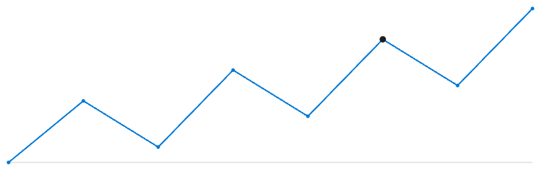

# Verso.Sample.Sparkline

A sample Verso **layout extension** that demonstrates an *isolated* (iframe) renderer. It draws a sparkline on an HTML `<canvas>` from a numeric kernel variable, streams updates into the live frame as the variable changes, and reports the user's point selection back to the kernel.

It is the worked example for the "Isolated (iframe) layouts" section of the [layout authoring guide](../../../docs/extensions/layouts.md).



## What it shows

- **Renderer isolation.** `RendererIsolation => Isolated` and `GetRendererPackageAsync` returns a single self-contained `main.js`. Because the renderer is pure `<canvas>` with no external script, it needs no extra Content Security Policy and returns `ContentSecurityPolicy: null`.
- **Streaming data into a live frame.** `ILayoutLifecycleHandler.OnRendererMountedAsync` seeds the frame with the current `series` value and subscribes to variable changes; `ILayoutFrameChannel.PostMessageAsync` pushes each update. `OnRendererUnmountedAsync` cancels the subscription.
- **Interactions from the frame.** `ILayoutInteractionHandler` handles a `select-point` interaction and writes the chosen index to the `selectedPoint` kernel variable.
- **Theme tracking.** The renderer reads the host's `--verso-*` theme tokens, so the chart re-colors when the active theme changes.

## How it works

| Piece | Responsibility |
|---|---|
| `SparklineLayout.cs` | The layout engine, lifecycle handler, and interaction handler. |
| `assets/main.js` | The iframe renderer. Embedded as an assembly resource and shipped in the renderer package. |
| `RendererScript.cs` | Loads the embedded `main.js` at runtime. |

Data flow:

1. The host mounts the iframe and installs the `window.verso` bridge. `main.js` registers a message handler and calls `verso.ready()`.
2. The host runs `OnRendererMountedAsync`, which returns the current `series` as initial state. The host delivers it to the frame on `verso/init` under `extension`.
3. When the `series` variable changes, the lifecycle handler pushes the new values; the frame receives them as `ext/data` and repaints.
4. Clicking a point calls `verso.interact("select-point", { index, value })`. The interaction handler writes the index to `selectedPoint`.

## Build

```bash
dotnet build samples/SampleLayout/Verso.Sample.Sparkline/Verso.Sample.Sparkline.csproj
```

Run the tests:

```bash
dotnet test samples/SampleLayout/Verso.Sample.Sparkline.Tests/Verso.Sample.Sparkline.Tests.csproj
```

The build produces `Verso.Sample.Sparkline.dll`. Load it like any other Verso extension: drop it on `verso.extensionsPath`, or load it from a notebook with `#!extension`.

## Try it in a notebook

1. Load the extension and switch the notebook to the **Sparkline** layout.
2. In a C# cell, set the variable the sparkline plots:

   ```csharp
   var series = new double[] { 3, 7, 4, 9, 6, 11, 8, 13 };
   ```

   The chart draws the series. Assigning a new array repaints it live.
3. Click a point on the chart. The selected index is written to `selectedPoint`:

   ```csharp
   selectedPoint   // the index you clicked
   ```

The variable can be any numeric sequence (`double[]`, `int[]`, `List<double>`, …); the layout coerces it to a numeric array.
