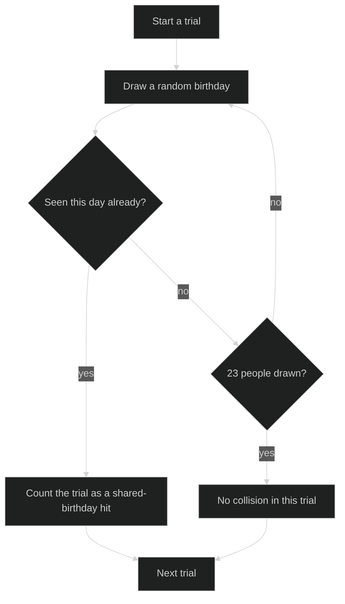

# The Birthday Paradox

You are reading a plain Markdown file that is also a Verso notebook. On GitHub it renders as an ordinary article. Opened in Verso (right-click the file in VS Code and choose **Open as Verso Notebook**, or run `verso serve sample-markdown.md`), every fenced C# block below becomes an executable cell, so you can run the argument instead of just reading it.

The question: how many people do you need in a room before it is more likely than not that two of them share a birthday?

Most people guess somewhere near 180, reasoning that you need to cover half of the 365 possible days. The real answer is 23. This notebook shows why, three different ways.

## 1. The exact calculation

Rather than asking "what is the chance two people match", flip it around: what is the chance that *nobody* matches? Each new person must avoid every birthday already taken, so the probabilities multiply and shrink fast.

```csharp
double pAllDistinct = 1.0;
for (int person = 1; person < 23; person++)
    pAllDistinct *= (365.0 - person) / 365.0;

Console.WriteLine($"Chance of a shared birthday among 23 people: {1 - pAllDistinct:P2}");
```

Run the cell above and you get just over 50 percent. Twenty-three people, better than a coin flip.

## 2. Do not trust the algebra? Simulate it

A Monte Carlo check: fill a room with 23 random birthdays, see if any collide, repeat a hundred thousand times.

```csharp
var random = new Random(2026);
const int trials = 100_000;
int trialsWithSharedBirthday = 0;

for (int trial = 0; trial < trials; trial++)
{
    var seenBirthdays = new HashSet<int>();
    for (int person = 0; person < 23; person++)
    {
        if (!seenBirthdays.Add(random.Next(365)))
        {
            trialsWithSharedBirthday++;
            break;
        }
    }
}

Console.WriteLine($"Simulated over {trials:N0} trials: {(double)trialsWithSharedBirthday / trials:P2}");
```

The simulation follows this loop for every trial:



The diagram is a Mermaid cell in Verso and a Mermaid code block on GitHub, so it renders in both places. Expect the simulated figure to land within a fraction of a percent of the exact one, roughly like this:

```
Chance of a shared birthday among 23 people: 50.73%
Simulated over 100,000 trials: 50.58%
```

That last block has no language tag, so Verso keeps it as part of the prose rather than turning it into a code cell. Untagged fences are how you quote expected output, logs, or transcripts inside a notebook.

## 3. The intuition: count pairs, not people

The paradox stops being paradoxical once you count the right thing. Twenty-three people do not give you 23 chances of a match. Every *pair* of people is a chance, and pairs grow quadratically.

```csharp
int people = 23;
int pairs = people * (people - 1) / 2;

Console.WriteLine($"{people} people form {pairs} distinct pairs.");
Console.WriteLine($"Chance that none of those pairs match, approximately: {Math.Pow(364.0 / 365.0, pairs):P2}");
```

Two hundred fifty-three lottery tickets, each with a 1 in 365 chance, is a very different bet than the one your intuition priced.

## How steep is the curve?

The probability climbs startlingly fast. This cell sketches the whole curve as a bar chart in plain text.

```csharp
Console.WriteLine("People  Chance   ");
for (int people = 5; people <= 70; people += 5)
{
    double allDistinct = 1.0;
    for (int k = 1; k < people; k++)
        allDistinct *= (365.0 - k) / 365.0;

    var bar = new string('#', (int)Math.Round((1 - allDistinct) * 40));
    Console.WriteLine($"{people,6}  {1 - allDistinct,7:P1}  {bar}");
}
```

By 50 people the odds pass 97 percent. By 70 they are within rounding distance of certainty, while still covering less than a fifth of the calendar.

## Try it yourself

Every cell above is editable. Some experiments worth a minute each:

- Change `365` to `366` in the first cell. How much does one extra day move the threshold?
- Binary-search the first cell by hand: what head count first pushes the chance past 99 percent?
- Change the simulation seed and rerun. How much do 100,000 trials wobble between runs?
- Add a new C# cell that finds the smallest group where a shared birthday is more likely than not, by looping until the probability crosses 0.5.

## How this file works

A few rules govern how Verso reads and writes Markdown notebooks:

- Prose lives in markdown cells. A top-level fenced code block whose language tag Verso recognizes (`csharp`, `fsharp`, `python`, `javascript`, `typescript`, `pwsh`, `sql`, `html`, `mermaid`, and their short aliases) becomes a cell of the matching kind.
- Untagged or unrecognized fences, indented code, and fences nested inside quotes or lists stay part of the prose, like the expected-output block earlier.
- Saving writes plain Markdown back to this same file, and cell outputs are never persisted, so the file stays clean in version control and readable everywhere Markdown renders.
- When a notebook outgrows Markdown (persistent outputs, custom layouts, parameters), use **Export, then Verso** in the toolbar to produce a `.verso` copy, or run `verso convert sample-markdown.md --to verso`.

That makes this format a good fit for material meant to be read and run: tutorials, runnable documentation, lab exercises, and articles like this one, whether a person wrote them or an AI did.
